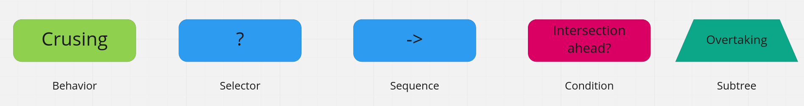
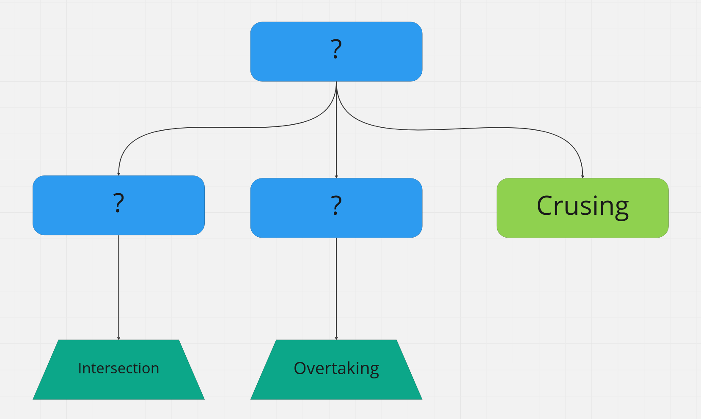
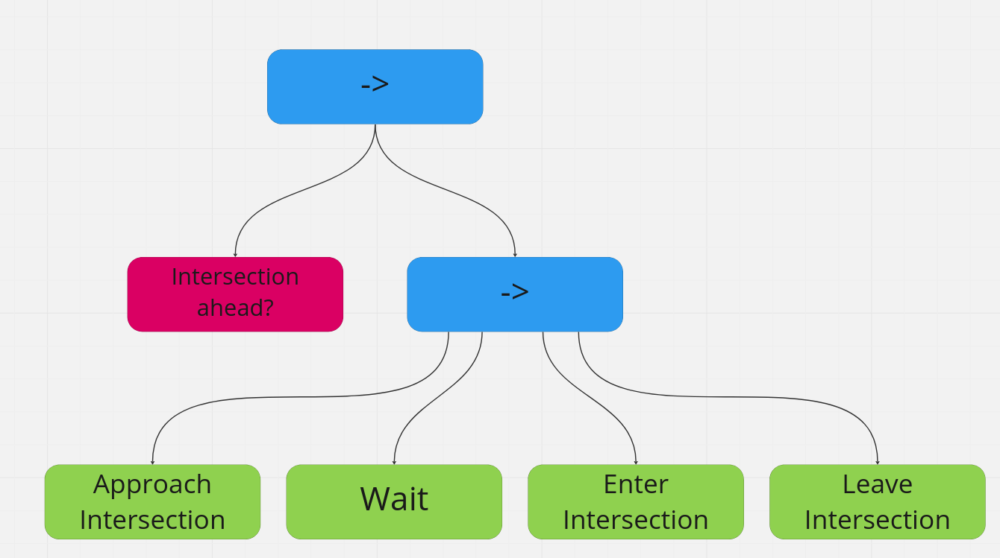
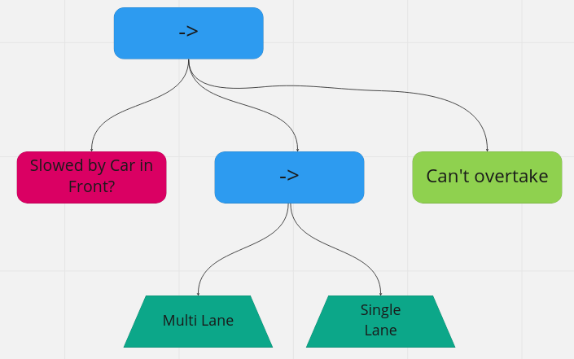
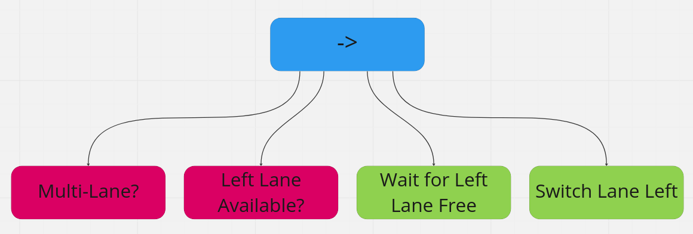
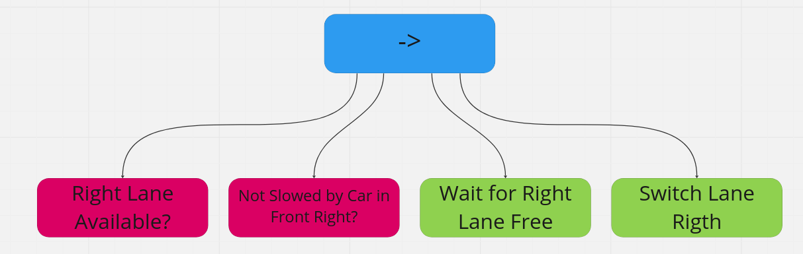

[//]: # ()
[//]: # (""")

[//]: # (Source: https://github.com/ll7/psaf2)

[//]: # (""")

# behaviour_agent

**Disclaimer**: As we mainly built our decision tree on the previous [PAF project](https://github.com/ll7/psaf2), most part of the documentation was added here and adjusted to the changes we made.

## About

This Package implements a behaviour agent for our autonomous car using **Behaviour Trees**. It uses the `py_trees` Framework, that works well with ROS.
For visualization at runtime you might want to also install this [rqt-Plugin](https://wiki.ros.org/rqt_py_trees).

## Our behaviour tree

The following section describes the behaviour tree we use for normal driving using all functionality provided by the agent. In the actual implementation this is part of a bigger tree, that handles things like writing topics to the blackboard, starting and finishing the decision tree.
The following description is not complete, it just contains the most common behaviours and subtrees. For a complete description have a look at the [tree-description](../../../doc/07_planning/behaviortree.xml) and the [bt-specs](../../../doc/07_planning/behavior_tree_spec.md).
Note that we didn't actually implement all the behaviours from this design, due to time and functionality limitations.

### Legend

The following notation is used in this documentation:



#### Behavior

Represent an action the decision tree should execute. It has three return values representing the state of the behavior:

* `SUCCESS`: The action has been performed successfully.
* `RUNNING`: The action is still being executed.
* `Failure`: The action couldn't be executed.

#### Selector

Tries to execute each of its child behaviors in turn. It has a priority hierarchy from left (high priority) to right (low priority).

#### Sequence

Executes all of its child behaviors sequentially after one another until all behaviors have returned `SUCCESS` or one behavior returned `FAILURE`. In that case, the sequence is aborted.

#### Condition

Is always the first child of a sequence. It decides if the sequence should be executed or aborted.

#### Subtree

Represents a specific task/scenario which is handled by the decision tree.

### Big Picture



This top-level tree consists mainly of subtrees that are explained below. If none of the subtrees fit the current situation, the behaviour_agent goes into `Cruising`-behaviour, where it just follows the Path at an appropriate speed.

### Intersection



If there is an intersection coming up, the agent executes the following sequence of behaviours:

* Approach Intersection

    Slows down and stops at line if a stop sign or a yellow or red traffic light is detected

* Wait at Intersection

    Waits for traffic lights or higher priority traffic

* Enter Intersection

    Enters the intersection and follows it predetermined path through the intersection

* Leave Intersection

    Leaves the intersection in the right direction

### Overtaking

The Overtaking subtree is quite big to accommodate for different overtaking scenarios. Here is an overview of that subtree further refining it.



Please have a look at the [tree-description](../../../doc/07_planning/behaviortree.xml) and the [bt-specs](../../../doc/07_planning/behavior_tree_spec.md) for a more detailed description. The Multi-Lane Overtaking Subtree looks like this:



* Multi Lane?

    Checks the map data: does the current road have more than one lane?

* Left Lane available?

    The lane detection checks if there is a lane to the left

* Wait for Left Lane free

    Waits for the left lane to be free. This has a timeout.

* Switch Lane Left

    Triggers a lane switch to the left by calling the local planner

### Right-Hand Driving

This subtree makes the ego vehicle switch back to the right lane, if the road ahead is free enough. It is quite similar to the Multi-Lane Overtaking Subtree, just with reversed directions.



## Developing guide

### Tree Definition

The tree is defined in the `grow_a_tree()`-function inside `code/planning/behavior_agent/behavior_tree.py`, which is also the main node. It can be visualized using an [rqt-Plugin](https://wiki.ros.org/rqt_py_trees). This is also the place to change the execution rate of the tree:

``` python
...
behaviour_tree.tick_tock(500)
...
```

### Behaviours

`Behaviours` are implemented in the `code/planning/behavior_agent/behaviours/` directory. All the behaviours used in the current version of the tree are contained as skeletons.

#### Blackboard

To deal with the asynchronicity of ROS, all the topics this tree subscribes to, should be written to the Blackboard at the beginning of each tick. A node is available, that automates this task. Just add your node to the list in `src/behavior_agent/behaviours/topics2blackboard.py`:

``` python
...
topics =[
    {'name':f"/carla/{role_name}/Speed", 'msg':CarlaSpeedoMeter, 'clearing-policy': py_trees.common.ClearingPolicy.NEVER},
    ...
    ]
...
```

After that you can access them from everywhere in your Behaviour-Code using:

``` python
...
self.blackboard = py_trees.blackboard.Blackboard()
...
speed = self.blackboard.get("/carla/hero/Speed")
...
```

Note that you still need to resolve the data-fields of the message (i.e. `blackboardmessage.data` for a `Float64`).

### Guidelines

When implementing new behaviours you should adhere to the following guidelines:

#### Non-Blocking

You should avoid doing complicated calculations inside the behaviours. Use asynchronous Callbacks instead, and return ```RUNNING``` while another node does the computing.

Generally conditions should never return ```RUNNING``` and Action-Behaviours should only return ```FAILURE``` in special cases.

#### Functions

Behaviours generally provide five functions (you can define more of course). Short explanation when they get called and how to use them:

##### `__init__()`

You should probably never use this.

##### `setup()`

Gets called whenever the tree gets set up for the first time. Use this to setup local variables that don't need to change, like ```self.blackboard = py_trees.blackboard.Blackboard()``` or middleware like ROS-Publishers (Subscribers should be setup using the method mentioned above).

##### `initialise()`

Gets called everytime the behaviour is entered for a new execution. Add code that only needs to called once at the beginning of a behaviour (i.e. publishing a new target speed).

##### `update()`

Main function of a behaviour, that gets called everytime the behaviour is ticked. Here you need to return ```SUCCESS```, ```RUNNING``` or ```FAILURE```.

##### `terminate()`

This gets called, whenever a behaviour is cancelled by a higher priority branch. Use to terminate middleware connections or asynchronous Calculations, whose results are not needed anymore.

## Authors

Josef Kircher
