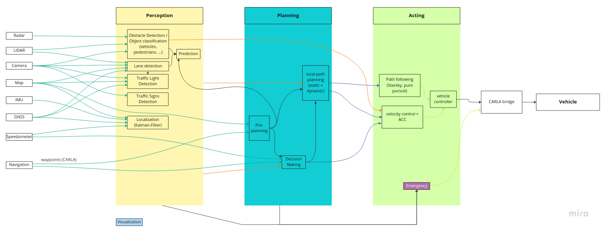

# Architecture of vehicle agent

**Summary:** This page gives an overview over the general architecture of the vehicle agent.
The document contains an overview over all [nodes](#overview) and [topics](#topics).

---

## Authors

Marco Riedenauer, Simon Erlbacher, Julian Graf

## Date

25.11.2022

---
<!-- TOC -->

* [Architecture of vehicle agent](#architecture-of-vehicle-agent)
  * [Author](#authors)
  * [Date](#date)
  * [Overview](#overview)
  * [Perception](#perception)
    * [Obstacle Detection and Classification](#obstacle-detection-and-classification)
    * [Lane detection](#lane-detection)
    * [Traffic Light Detection](#traffic-light-detection)
    * [Traffic Signs Detection](#traffic-signs-detection)
    * [Prediction](#prediction)
    * [Localization](#localization)
  * [Planning](#planning)
    * [Preplanning](#preplanning)
    * [Decision Making](#decision-making)
    * [Local path planning](#local-path-planning)
  * [Acting](#acting)
    * [Path following](#path-following)
    * [Velocity control](#velocity-control)
    * [Emergency](#emergency)
  * [Visualization](#visualization)
  * [Topics](#topics)

<!-- TOC -->

## Overview

The vehicle agent is split into three major components: [Perception](#Perception), [Planning](#Planning)
and [Acting](#Acting).
A separate node is responsible for the [visualization](#Visualization).
The topics published by the Carla bridge can be
found [here](https://carla.readthedocs.io/projects/ros-bridge/en/latest/ros_sensors/).
The msgs necessary to control the vehicle via the Carla bridge can be
found [here](https://carla.readthedocs.io/en/0.9.8/ros_msgs/#CarlaEgoVehicleControlmsg)



## Perception

The perception is responsible for the efficient conversion of raw sensor and map data into a useful
environment representation that can be used by the [Planning](#Planning) for further processing.

Further information regarding the perception can be found [here](../03_research/02_perception/Readme.md).

### Obstacle Detection and Classification

Evaluates sensor data to detect and classify objects around the ego vehicle.
Other road users and objects blocking the vehicle's path are recognized.
The node classifies objects into static and dynamic objects.
In the case of dynamic objects, an attempt is made to recognize the direction and speed of movement.

Subscriptions:

* ```radar``` ([sensor_msgs/PointCloud2](https://docs.ros.org/en/api/sensor_msgs/html/msg/PointCloud2.html))
* ```lidar``` ([sensor_msgs/PointCloud2](https://docs.ros.org/en/api/sensor_msgs/html/msg/PointCloud2.html))
* ```rgb_camera``` ([sensor_msgs/Image](https://docs.ros.org/en/api/sensor_msgs/html/msg/Image.html))
* ````gnss```` ([sensor_msgs/NavSatFix](https://carla.readthedocs.io/projects/ros-bridge/en/latest/ros_sensors/))
* ```map``` ([std_msgs/String](https://docs.ros.org/en/api/std_msgs/html/msg/String.html))

Publishes:

* ```obstacles``` (Custom msg:
  obstacle ([vision_msgs/Detection3DArray Message](http://docs.ros.org/en/api/vision_msgs/html/msg/Detection3DArray.html))
  and its classification ([std_msgs/String Message](http://docs.ros.org/en/noetic/api/std_msgs/html/msg/String.html)))

### Lane detection

Detects the lane the ego vehicle is currently in and the lanes around the ego vehicle.
This data can be used for lane keeping, to identify which lanes other road users are in,
and to plan and execute lane changes.

Subscriptions:

* ```map``` ([std_msgs/String](https://docs.ros.org/en/api/std_msgs/html/msg/String.html))
* ```lidar``` ([sensor_msgs/PointCloud2](https://docs.ros.org/en/api/sensor_msgs/html/msg/PointCloud2.html))
* ```rgb_camera``` ([sensor_msgs/Image](https://docs.ros.org/en/api/sensor_msgs/html/msg/Image.html))
* ```gnss``` ([sensor_msgs/NavSatFix](https://carla.readthedocs.io/projects/ros-bridge/en/latest/ros_sensors/))

* Publishes:

* ```lanes``` ([derived_object_msgs/LaneModels Message](http://docs.ros.org/en/kinetic/api/derived_object_msgs/html/msg/LaneModels.html))

### Traffic Light Detection

Recognizes traffic lights and what they are showing at the moment.
In particular traffic lights that are relevant for the correct traffic behavior of the ego vehicle,
are recognized early and reliably.

Subscriptions:

* ```map``` ([std_msgs/String](https://docs.ros.org/en/api/std_msgs/html/msg/String.html))
* ```rgb_camera``` ([sensor_msgs/Image](https://docs.ros.org/en/api/sensor_msgs/html/msg/Image.html))
* ```lidar``` ([sensor_msgs/PointCloud2](https://docs.ros.org/en/api/sensor_msgs/html/msg/PointCloud2.html))
* ```gnss``` ([sensor_msgs/NavSatFix](https://carla.readthedocs.io/projects/ros-bridge/en/latest/ros_sensors/))

Publishes:

* ```traffic_lights``` (Custom msg:
  state ([std_msgs/UInt8 Message](https://docs.ros.org/en/api/std_msgs/html/msg/UInt8.html])),
  position ([geometry_msgs/Pose Message](http://docs.ros.org/en/noetic/api/geometry_msgs/html/msg/Pose.html)),
  distance_to_stop_line ([std_msgs/Float64 Message](http://docs.ros.org/en/api/std_msgs/html/msg/Float64.html)))

### Traffic Signs Detection

Recognizes traffic signs.
In particular traffic signs that are relevant for the correct traffic behavior of the ego vehicle,
are recognized early and reliably.

Subscriptions:

* ```rgb_camera``` ([sensor_msgs/Image](https://docs.ros.org/en/api/sensor_msgs/html/msg/Image.html))
* ```lidar``` ([sensor_msgs/PointCloud2](https://docs.ros.org/en/api/sensor_msgs/html/msg/PointCloud2.html))

Publishes:

* ```traffic_signs``` (Custom msg:
  type ([std_msgs/UInt8 Message](https://docs.ros.org/en/api/std_msgs/html/msg/UInt8.html])),
  position ([geometry_msgs/Pose Message](http://docs.ros.org/en/noetic/api/geometry_msgs/html/msg/Pose.html)),
  distance_to_stop_line
  distance_to_stop_line ([std_msgs/Float64 Message](http://docs.ros.org/en/api/std_msgs/html/msg/Float64.html)))

### Prediction

Tries to predict the movement of dynamic objects recognized in the
[Obstacle Detection and Classification](#Obstacle-Detection-and-Classification).

Subscriptions:

* ```obstacles``` ([vision_msgs/Detection3DArray Message](http://docs.ros.org/en/api/vision_msgs/html/msg/Detection3DArray.html))
* ```lanes``` ([derived_object_msgs/LaneModels Message](http://docs.ros.org/en/kinetic/api/derived_object_msgs/html/msg/LaneModels.html))

Publishes:

* ```predictions``` (Custom msg: array of
  vehicle_id ([std_msgs/UInt16 Message](https://docs.ros.org/en/api/std_msgs/html/msg/UInt16.html)) and
  vehicle_path ([nav_msgs/Path Message](http://docs.ros.org/en/noetic/api/nav_msgs/html/msg/Path.html)))

### Localization

Provides corrected accurate position, direction and speed of the ego vehicle

Subscriptions:

* ```map``` ([std_msgs/String](https://docs.ros.org/en/api/std_msgs/html/msg/String.html))
* ```imu``` ([sensor_msgs/Imu Message](https://docs.ros.org/en/api/sensor_msgs/html/msg/Imu.html))
* ```speedometer``` ([std_msgs/Float32](https://docs.ros.org/en/api/std_msgs/html/msg/Float32.html))
* ```gnss``` ([sensor_msgs/NavSatFix](https://carla.readthedocs.io/projects/ros-bridge/en/latest/ros_sensors/))

Publishes:

* ```ego_position``` ([nav_msgs/Odometry Message](http://docs.ros.org/en/noetic/api/nav_msgs/html/msg/Odometry.html))

## Planning

The planning uses the data from the [Perception](#Perception) to find a path on which the ego vehicle can safely reach
its destination

Further information regarding the planning can be found [here](../03_research/03_planning/Readme.md).

### Preplanning

Uses information from the map and the path specified by CARLA to find a first concrete path to the next intermediate
point.
Information from [Obstacle Detection](#Obstacle-Detection-and-Classification), [Prediction](#Prediction) etc. is not
yet taken into account.

Subscriptions:

* ```map``` ([std_msgs/String](https://docs.ros.org/en/api/std_msgs/html/msg/String.html))
* ```navigation``` (waypoints and high-level route description)
* ```odometry``` ([nav_msgs/Odometry](https://docs.ros.org/en/api/nav_msgs/html/msg/Odometry.html))

Publishes:

* ```provisional_path``` ([nav_msgs/Path Message](http://docs.ros.org/en/noetic/api/nav_msgs/html/msg/Path.html))

### Decision Making

Checks whether the path from [Preplanning](#Preplanning) actually can be taken.
If the data from the [Perception](#Perception) indicates that the path needs to be adjusted,
this node decides which actions to take.
Based on this decision, the [Local path planning](#Local-path-planning) plans a new path accordingly.

Subscriptions:

* ```map``` ([std_msgs/String](https://docs.ros.org/en/api/std_msgs/html/msg/String.html))
* ```navigation``` (waypoints and high-level route description)
* ```odometry``` ([nav_msgs/Odometry](https://docs.ros.org/en/api/nav_msgs/html/msg/Odometry.html))
* ```provisional_path``` ([nav_msgs/Path Message](http://docs.ros.org/en/noetic/api/nav_msgs/html/msg/Path.html))
* all data from [Perception](#Perception)

Publishes:

* ```decision``` ([std_msgs/String](https://docs.ros.org/en/api/std_msgs/html/msg/String.html))

### Local path planning

Translates the decisions made by the [Decision Making](#Decision-Making) into a concrete path.
Can publish the distance to the vehicle in front to use the [Path following](#path-following)'s adaptive cruise control.

Subscriptions:

* ```map``` ([std_msgs/String](https://docs.ros.org/en/api/std_msgs/html/msg/String.html))
* ```odometry``` ([nav_msgs/Odometry](https://docs.ros.org/en/api/nav_msgs/html/msg/Odometry.html))
* ```provisional_path``` ([nav_msgs/Path Message](http://docs.ros.org/en/noetic/api/nav_msgs/html/msg/Path.html))
* all data from [Perception](#Perception)

Publishes:

* ```path``` ([nav_msgs/Path Message](http://docs.ros.org/en/noetic/api/nav_msgs/html/msg/Path.html))
* ```max_velocity``` ([std_msgs/Float64 Message](http://docs.ros.org/en/api/std_msgs/html/msg/Float64.html]))
* ```distance_to_next_vehicle``` ([std_msgs/Float64 Message](http://docs.ros.org/en/api/std_msgs/html/msg/Float64.html]))

## Acting

The job of this component is to translate the trajectory planned by the [Planning](#Planning) component into
steering controls for the vehicle.
This node only takes on tasks that have lower computing time, so that a fast response of the component is ensured.

Further information regarding the acting can be found [here](../03_research/01_acting/Readme.md).

### Path following

Calculates steering angles that keep the ego vehicle on the path given by
the [Local path planning](#Local-path-planning).

Subscriptions:

* ```path``` ([nav_msgs/Path Message](http://docs.ros.org/en/noetic/api/nav_msgs/html/msg/Path.html))

Publishes:

* ```steer```
  for ```vehicle_control_cmd_manual``` ([CarlaEgoVehicleControl.msg](https://carla.readthedocs.io/en/0.9.8/ros_msgs/#CarlaEgoVehicleControlmsg))

Note: To avoid competing ```vehicle_control_cmd_manual``` msgs, [Path following](#path-following) should publish custom
steering msgs that can then be published combined with velocity, etc. to single ```vehicle_control_cmd_manual```
by [Velocity control](#velocity-control).

### Velocity control

Calculates velocity inputs to drive the velocity given by the [Local path planning](#Local-path-planning).
If the node is given the distance to a car to follow, it reduces the velocity of the ego vehicle to hold a reasonable
distance to the vehicle in front.

Subscriptions:

* ```ego_position``` ([nav_msgs/Odometry Message](http://docs.ros.org/en/noetic/api/nav_msgs/html/msg/Odometry.html))
* ```max_velocity``` ([std_msgs/Float64 Message](http://docs.ros.org/en/api/std_msgs/html/msg/Float64.html]))
* ```distance_to_next_vehicle``` ([std_msgs/Float64 Message](http://docs.ros.org/en/api/std_msgs/html/msg/Float64.html]))
* ```path``` ([nav_msgs/Path Message](http://docs.ros.org/en/noetic/api/nav_msgs/html/msg/Path.html))

Publishes:

* ```throttle```,  ```brake```,  ```reverse```
  for ```vehicle_control_cmd_manual``` ([CarlaEgoVehicleControl.msg](https://carla.readthedocs.io/en/0.9.8/ros_msgs/#CarlaEgoVehicleControlmsg))

### Emergency

Reads data from all nodes to detect emergency situations.
Initiates emergency braking in the event of an emergency and notifies all notes that an emergency stop has occurred.

Subscriptions:

* all data that's needed

Publishes:

* ```vehicle_control_cmd_manual``` ([CarlaEgoVehicleControl.msg](https://carla.readthedocs.io/en/0.9.8/ros_msgs/#CarlaEgoVehicleControlmsg))
* ```emergency``` ([std_msgs/Bool Message](http://docs.ros.org/en/api/std_msgs/html/msg/Bool.html))

## Visualization

Visualizes outputs of certain nodes to provide a basis for debugging.

Subscriptions:

* all data that's needed

## Topics

The topics published by the Carla bridge can be
found [here](https://carla.readthedocs.io/projects/ros-bridge/en/latest/ros_sensors/).
The msgs necessary to control the vehicle via the Carla bridge can be
found [here](https://carla.readthedocs.io/en/0.9.8/ros_msgs/#CarlaEgoVehicleControlmsg)

Intern topics published by vehicle agent:

| Topic                          | Description                                                                                                       | Published by                                                 | Msg type                                                                                                                                                                                                                                                                                                                            |
|--------------------------------|-------------------------------------------------------------------------------------------------------------------|--------------------------------------------------------------|-------------------------------------------------------------------------------------------------------------------------------------------------------------------------------------------------------------------------------------------------------------------------------------------------------------------------------------|
| ```obstacles```                | Obstacles and their classifications                                                                               | [Obstacle Detection](#obstacle-detection-and-classification) | Custom msg: obstacle ([vision_msgs/Detection3DArray Message](http://docs.ros.org/en/api/vision_msgs/html/msg/Detection3DArray.html)) and its classification ([std_msgs/String Message](http://docs.ros.org/en/noetic/api/std_msgs/html/msg/String.html))                                                                            |
| ```lanes```                    | Lanes surrounding vehicle                                                                                         | [Lane detection](#lane-detection)                            | [derived_object_msgs/LaneModels Message](http://docs.ros.org/en/kinetic/api/derived_object_msgs/html/msg/LaneModels.html)                                                                                                                                                                                                           |
| ```traffic_lights```           | Traffic lights and their status                                                                                   | [Traffic Light Detection](#traffic-light-detection)          | Custom msg: state ([std_msgs/UInt8 Message](https://docs.ros.org/en/api/std_msgs/html/msg/UInt8.html])), position ([geometry_msgs/Pose Message](http://docs.ros.org/en/noetic/api/geometry_msgs/html/msg/Pose.html)), distance_to_stop_line ([std_msgs/Float64 Message](http://docs.ros.org/en/api/std_msgs/html/msg/Float64.html)) |
| ```predictions```              | Expected future movement of dynamic obstacles                                                                     | [Prediction node](#prediction)                               | Custom msg: array of vehicle_id ([std_msgs/UInt16 Message](https://docs.ros.org/en/api/std_msgs/html/msg/UInt16.html)) and vehicle_path ([nav_msgs/Path Message](http://docs.ros.org/en/noetic/api/nav_msgs/html/msg/Path.html))                                                                                                    |
| ```ego_position```             | Corrected accurate position, direction and speed of the ego vehicle                                               | [Localization](#localization)                                | [nav_msgs/Odometry Message](http://docs.ros.org/en/noetic/api/nav_msgs/html/msg/Odometry.html)                                                                                                                                                                                                                                      |
| ```provisional_path```         | First concrete path to the next intermediate point                                                                | [Preplanning](#preplanning)                                  | [nav_msgs/Path Message](http://docs.ros.org/en/noetic/api/nav_msgs/html/msg/Path.html)                                                                                                                                                                                                                                              |
| ```decision```                 | Decision to alter   ```provisional_path```                                                                        | [Decision Making](#decision-making)                          | [std_msgs/String](https://docs.ros.org/en/api/std_msgs/html/msg/String.html)                                                                                                                                                                                                                                                        |
| ```path```                     | Improved ```provisional_path```  path for the ego vehicle to follow                                               | [Local path planning](#local-path-planning)                  | [nav_msgs/Path Message](http://docs.ros.org/en/noetic/api/nav_msgs/html/msg/Path.html)                                                                                                                                                                                                                                              |
| ```max_velocity```             | Maximal velocity the ego vehicle should drive  in m/s                                                             | [Local path planning](#local-path-planning)                  | [std_msgs/Float64 Message](http://docs.ros.org/en/api/std_msgs/html/msg/Float64.html])                                                                                                                                                                                                                                              |
| ```distance_to_next_vehicle``` | Distance to   the vehicle the      [Velocity control](#velocity-control) should keep a certain distance to (in m) | [Local path planning](#local-path-planning)                  | [std_msgs/Float64 Message](http://docs.ros.org/en/api/std_msgs/html/msg/Float64.html])                                                                                                                                                                                                                                              |
| ```emergency```                | True if emergency is triggered; false indicates that emergency is over                                            | [Emergency](#emergency)                                      | [std_msgs/Bool Message](http://docs.ros.org/en/api/std_msgs/html/msg/Bool.html)                                                                                                                                                                                                                                                     |
