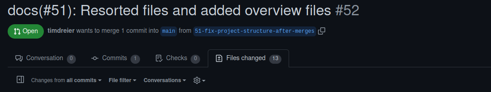
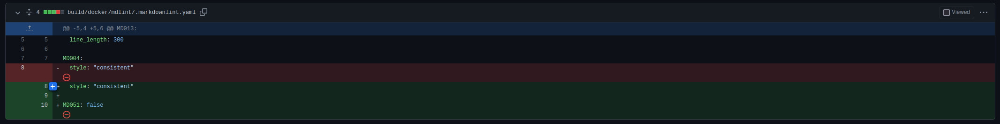
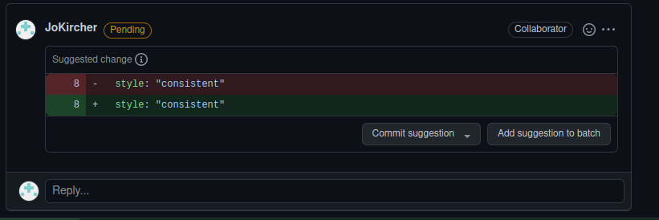

# Review Guidelines

**Summary:** This page gives an overview over the steps that should be taken during a review and how to give a helpful and constructive review

---

## Author

Josef Kircher

## Date

17.11.2022

## Prerequisite

---
<!-- TOC -->
* [Review Guidelines](#review-guidelines)
  * [Author](#author)
  * [Date](#date)
  * [Prerequisite](#prerequisite)
  * [How to review](#how-to-review)
  * [How to comment on a pull request](#how-to-comment-on-a-pull-request)
  * [Incorporating feedback](#incorporating-feedback)
    * [Responding to comments](#responding-to-comments)
    * [Applying suggested changes](#applying-suggested-changes)
    * [Re-requesting a review](#re-requesting-a-review)
    * [Resolving conversations](#resolving-conversations)
  * [Sources](#sources)
<!-- TOC -->

---

## How to review

1. Select der PR you want to review on GitHub

2. Go to Files Changed

3. Hover over the line where you want to add a comment and click on the blue `+` at the beginning of the line to add a comment

4. If you want to comment on multiple lines click and drag over these lines
5. In the comment field type your comment. How to write a good comment is handled in the next section.
6. You can also add a suggestion by using ``Ctrl+G`` or the small paper icon in the header line of the comment

7. If you finished with the file you can check ``Viewed`` in the top right corner and the file collapses

8. To finish your review click ``Review Changes``

9. Type a comment summarizing your review
10. Select the type of review you like to leave:
    11. Comment - General feedback without approval
    12. Approve - Approve of merging this pull request
    13. Request Changes - this pull request is not mergeable and fixes are needed
11. Click `Submit Review`

## How to comment on a pull request

* Familiarize yourself with the context of the issue, and reasons why this Pull Request exists.
* If you disagree strongly, consider giving it a few minutes before responding; think before you react.
* Ask, don’t tell. (“What do you think about trying…?” rather than “Don’t do…”)
* Explain your reasons why code should be changed. (Not in line with the style guide? A personal preference?)
* Offer ways to simplify or improve code.
* Avoid using derogatory terms, like “stupid”, when referring to the work someone has produced.
* Be humble. (“I’m not sure, let’s try…”)
* Avoid hyperbole. (“NEVER do…”)
* Aim to develop professional skills, group knowledge and product quality, through group critique.
* Be aware of negative bias with online communication. (If content is neutral, we assume the tone is negative.) Can you use positive language as opposed to neutral?
* Use emoji to clarify tone. Compare “✨ ✨ Looks good 👍 ✨ ✨” to “Looks good.”

## Incorporating feedback

### Responding to comments

* Consider leading with an expression of appreciation, especially when feedback has been mixed.
* Ask for clarification. (“I don’t understand, can you clarify?”)
* Offer clarification, explain the decisions you made to reach a solution in question.
* Try to respond to every comment.
* Link to any follow up commits or Pull Requests. (“Good call! Done in 1682851”)
* If there is growing confusion or debate, ask yourself if the written word is still the best form of communication. Talk (virtually) face-to-face, then mutually consider posting a follow-up to summarize any offline discussion (useful for others who be following along, now or later).

### Applying suggested changes

If the reviewer not only left comments but also made specific suggestions on code parts, as shown  in [How to review](#how-to-review), you can incorporate them straight away.

1. Go to the corresponding pull request on GitHub
2. Navigate to the first suggested change
3. If you want to commit that change in a single commit, click ``Commit suggestion``
4. If you want to put more changes together to a single commit, click ``Add suggestion to batch``

5. In the commit message field, type a short and meaningful commit message according to the [commit rules](./03_commit.md)
6. Click ``Commit changes``

### Re-requesting a review

If you made substantial changes to your pull request and want to a fresh review from a reviewer, contact him directly. It is appropriate to ask the same reviewer from the initial pull request as he/she is most familiar with the pull request.

### Resolving conversations

If a comment of a review was resolved by either, a new commit or a discussion between the reviewer and the team that created the pull request, the conversation can be marked as resolved by clicking ``Resolve conversation`` in the ``Conversation`` or ``Files Changed`` tab of the pull request on GitHub.
If a new commit took place it is encouraged to comment the commit SHA to have a connection between comment and resolving commit

---

## Sources

<https://docs.github.com/en/pull-requests/collaborating-with-pull-requests/reviewing-changes-in-pull-requests/reviewing-proposed-changes-in-a-pull-request>

<https://github.blog/2015-01-21-how-to-write-the-perfect-pull-request/>

<https://docs.github.com/en/pull-requests/collaborating-with-pull-requests/reviewing-changes-in-pull-requests/incorporating-feedback-in-your-pull-request>

<https://docs.github.com/en/pull-requests/collaborating-with-pull-requests/reviewing-changes-in-pull-requests/commenting-on-a-pull-request>
