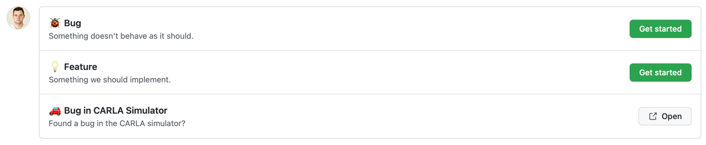

# Project management

**Summary:** We use a [Github Project](https://github.com/users/ll7/projects/2) for project management.
Any bugs or features requests are managed in Github.

---

## Author

Tim Dreier
Josef Kircher

## Date

23.11.2022

## Prerequisite

---
<!-- TOC -->
* [Project management](#project-management)
  * [Author](#author)
  * [Date](#date)
  * [Prerequisite](#prerequisite)
  * [Create bug or feature requests](#create-bug-or-feature-requests)
    * [🐞 Bug](#-bug)
      * [Example for "Bug"](#example-for--bug-)
    * [💡 Feature](#-feature)
      * [Example for "Feature"](#example-for--feature-)
    * [🚗 Bug in CARLA Simulator](#-bug-in-carla-simulator)
      * [Example for "Bug in CARLA Simulator"](#example-for--bug-in-carla-simulator-)
  * [Create a Pull Request](#create-a-pull-request)
  * [Merging a Pull Request](#merging-a-pull-request)
<!-- TOC -->

---

## Create bug or feature requests

Bugs or features can be added [here](https://github.com/ll7/paf22/issues/new/choose) or via the [issue overview](https://github.com/ll7/paf22/issues).

By clicking "New issue" in the overview or using the direct link above a wizard guides you to the creation of an issue:

The possibilities are described in the following sections.

### 🐞 Bug

Use this issue type if you encounter a problem which should already work.
If something is not expected to work, but you want to have it, please refer to the Feature section.

#### Example for "Bug"

The documentation says that the vehicle should detect about 90% of the traffic lights.
However, for you it ignores almost all traffic lights.

### 💡 Feature

Use this template if you want a new Feature which is not implemented yet.

#### Example for "Feature"

Currently, the vehicle can't make u-turns.
Implementing the ability to perform u-turns would be a new feature.

### 🚗 Bug in CARLA Simulator

This is a shortcut to directly report an issue in CARLA Simulator which is not an error in this project.

#### Example for "Bug in CARLA Simulator"

CARLA simulator crashes on startup on your machine.

## Create a Pull Request

To create a pull request, go to the [branches overview](https://github.com/ll7/paf22/branches) and select ``New Pull Request`` for the branch you want to create a PR for.

Alternatively you can create a PR directly from PyCharm using the ``Pull Request`` tab on the sidebar.

For completing the pull request, fill out the template that opens up automatically.

Merge the pull request after the review process is complete and all the feedback from the reviewer has been worked in.

For more information about the review process, see [Review process](./07_review_guideline.md).

## Merging a Pull Request

The reviewer should always be the person to merge the PR after an approved review.

If the reviewer has anything he/she would like to have changed or clarified, the review should be marked as `Request Changes`.
If there are no uncertainties the reviewer merges the PR. After a revision of the requested changes the reviewer conducts a second review, if he/she is satisfied with the changes, the PR will be merged by him/her.

Long story short, the reviewer who approves the PR should merge. Only approve if there is nothing to change.

## Deadlines for pull requests and reviews

The deadline for submitting a pull request is **Tuesday** before the end of the sprint at **12:15**.

The deadline for submitting a review for a pull request is **Wednesday** before the end of the sprint at **12:15**.
