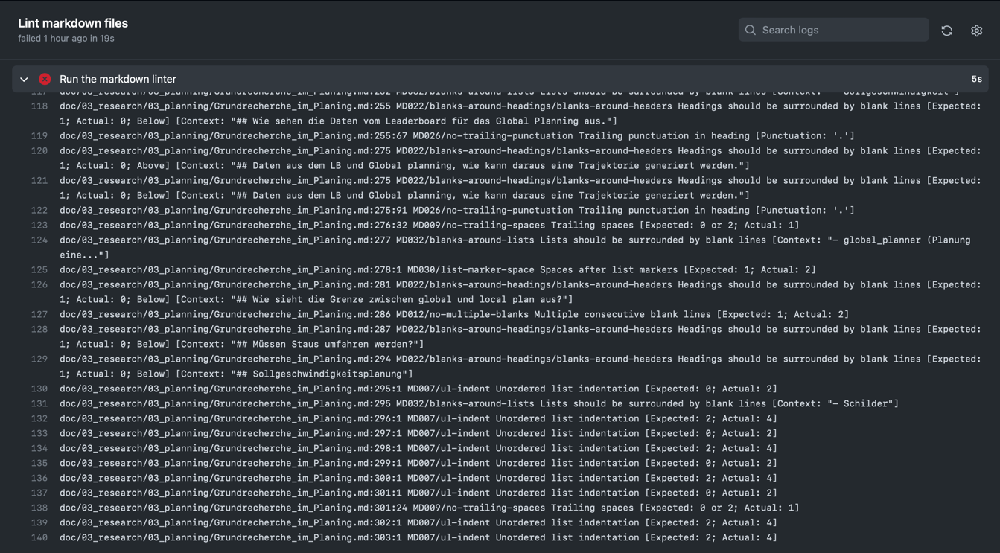
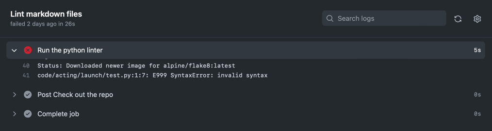

# Github actions

**Summary:** This page explains the GitHub actions we use to unsure Code quality.

---

## Author

Tim Dreier

## Date

25.11.2022

## Table of contents
<!-- TOC -->
* [Github actions](#github-actions)
  * [Author](#author)
  * [Date](#date)
  * [Table of contents](#table-of-contents)
  * [General](#general)
  * [Pull requests](#pull-requests)
  * [🚨 Common Problems](#-common-problems)
    * [1. Error in the markdown linter](#1-error-in-the-markdown-linter)
    * [2. Error in the python linter](#2-error-in-the-python-linter)
<!-- TOC -->

## General

We use a github action to verify code quality.
These actions are defined in `.github/workflows/linter.yml`.

The actions are executed only on pull requests in order not to exceed the [minutes per month included in the Github](https://docs.github.com/en/billing/managing-billing-for-github-actions/about-billing-for-github-actions) free plan.
This is done by limiting the execution of the action by the following line:

```yaml
on: pull_request
```

The actions uses the same linters described in the section [Linting](./02_linting.md).

Event though the linters are already executed during commit,
the execution on pull request ensures that nobody skips the linter during commit.

## Pull requests

The action must pass successful to merge a pull request.
To enforce this behaviour, we set the action as requirement as described in the following:

> You can add rules to your branches and how your merge request works.
>
> Your repo -> Settings -> branches -> Branch protection rules -> Add rule
>
> There, you will find something called Require status checks to pass before merging. Under this, you should see Status checks found in the last week for this repository. If you find the status you want to be passed before merging, you can enable the same.
>
> Docs: <https://help.github.com/en/github/administering-a-repository/defining-the-mergeability-of-pull-requests>
>
> [(Source)](https://stackoverflow.com/questions/60776412/github-actions-is-there-a-way-to-make-it-mandatory-for-pull-request-to-merge)

More information about creating and merging pull requests can be found [here](./08_project_management.md).

## 🚨 Common Problems

### 1. Error in the markdown linter

If there are errors in any file which need to be fixed,
the output of the action will look similar to this:



### 2. Error in the python linter

If there are errors in any python file,
the output of the action will look similar to this:



This step even runs if the markdown linter has already failed.
This way, all errors of different steps are directly visible
instead of errors only becoming apparent after errors in the previous steps have been fixed.

* <https://aschmelyun.com/blog/using-docker-run-inside-of-github-actions/>
