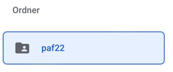
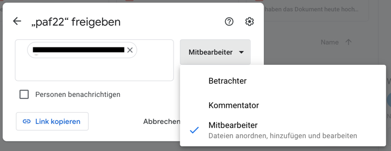

# Data Version Control (DVC)

**Summary:** This page describes what DVC is and how/where to use it.

---

## Author

Tim Dreier

## Date

8.12.2022

## Table of contents
<!-- TOC -->
* [Data Version Control (DVC)](#data-version-control--dvc-)
  * [Author](#author)
  * [Date](#date)
  * [Table of contents](#table-of-contents)
  * [General](#general)
    * [Installation](#installation)
    * [Storage](#storage)
  * [Using DVC](#using-dvc)
    * [Add file or folder to DVC](#add-file-or-folder-to-dvc)
    * [Pull / push](#pull--push)
      * [Authentication](#authentication)
    * [Python API](#python-api)
  * [Example](#example)
<!-- TOC -->

## General

DVC enables us to manage our datasets and trained models outside from git.
Instead of storing the full datasets or models inside git, DVC will just store a reference to the dataset or trained model stored in a separate storage.
This makes it possible to switch between versions of datasets and trained models and train models without touching the git repo.


(Taken from <https://dvc.org/>)

A more detailed summary about what it does cant be found [here (german)](https://www.marianbiermann.de/data-version-control-reproduzierbares-machine-learning/).
Additional information can also be found in the according [GitHub repsoitory](https://github.com/iterative/dvc)

### Installation

Install DVC and the according gdrive extension by running `pip install dvc dvc-gdrive`.

### Storage

Currently, we use Google Drive as repo for DVC.
Pull access is available for everyone, since the storage folder is accessible for everyone with the link.

However, if you want to push changes you need write access.
An administrator has to add your Google Account by doing the following.

1. Go to `https://drive.google.com` and login with our user
2. Click the folder `paf22`:


3. click on `Manage permissions` on the right side
4. Add the user as `Collaborator`



## Using DVC

### Add file or folder to DVC

To add a file or folder to DVC use the following commands:

```shell
# Add file data/data.xml
dvc add data/data.xml

# Add the whole data directory
dvc add data
```

   > ❗️ if you already added the directory to git you have to remove it by running `git rm -r --cached '<file or foldername>'`

### Pull / push

The commands to pull and push are similar to git. However, for pushing an authentication may be required.

```shell
# pull
dvc pull

# push
dvc push

# checkout (run after doing git checkout)
dvc checkout
```

#### Authentication

When pushing the first time you will receive a message similar to this:

```shell
Your browser has been opened to visit:

https://accounts.google.com/o/oauth2/auth?client_id=xxxxxxxxxxxx
```

To authenticate please click the link and login with your Google account.

> ❗️ Your Google account has to be added to the users with write access. Please contact [@timdreier](https://www.github.com/timdreier) or [@ll7](https://github.com/ll7).

After this, you should get a success message similar to this in your browser:

```text
The authentication flow has completed.
```

Back in your shell, you should see that the push was successful.

### Python API

DVC also provides a great Python API, which makes it possible to use models stored in DVC directly.
This way, the model is automatically loaded during code execution, so developers who do not work directly with the models or datasets do not have to care about DVC.

```python
import dvc.api

with dvc.api.open(
    'get-started/data.xml',
    repo='https://github.com/iterative/dataset-registry'
) as f:
    # f is a file-like object which can be processed normally
```

([Source](https://dvc.org/doc/start/data-management/data-and-model-access#python-api))

More information can be found [here](https://dvc.org/doc/api-reference).

### Experiments

> "In machine learning projects, the number of experiments grows rapidly DVC can track experiments,
list and compare their most relevant metrics, parameters, and dependencies,
navigate among them and commit only the ones that we need to Git." [(Source)](https://dvc.org/doc/start/experiment-management/experiments)

Detailed documentation with a [good example](https://github.com/iterative/example-dvc-experiments)
can be found [here](https://dvc.org/doc/start/experiment-management/experiments).

A working experiment in this project can be found [here](../../code/perception/src/traffic_light_detection/Readme.md)

#### Common commands

##### 1. Run training

Trains a new model.

```shell
# e.g. in /workspace/code/perception/src/traffic_light_detection run
dvc exp run
```

##### 2. Show all experiments

```shell
# e.g. in /workspace/code/perception/src/traffic_light_detection run
dvc exp show
```

Outputs all available experiments:

```shell
  Experiment                                                         Created        train.accuracy   train.loss   validation.accuracy   validation.loss   step   train.epochs   code/perception/src/traffic_lig>
 ──────────────────────────────────────────────────────────────────────────────────────────────────────────────────────────────────────────────────────────────────────────────────────────────────────────────>
  workspace                                                          -                      99.402     0.023711                98.429           0.02385     23   24             3a55939                        >
  130-feature-implement-dvc-experiment-for-traffic-light-detection   Jan 06, 2023           98.932     0.023871                98.953          0.023652     99   -              3a55939                        >
  ├── 35331c2 [exp-d30c9]                                            12:12 PM               99.402     0.023711                98.429           0.02385     23   24             3a55939                        >
  └── e4bdd28 [exp-5b049]                                            12:02 PM               99.316     0.023731                98.953          0.023753     99   100            3a55939                        >
 ──────────────────────────────────────────────────────────────────────────────────────────────────────────────────────────────────────────────────────────────────────────────────────────────────────────────>
```

##### 3. Commit an experiment

```shell
# commit changes in git
git add .

# push changes in dvc
git commit -m "feat(#xx): xxx"
dvc push
```

#### Using PyTorch

<https://dvc.org/doc/dvclive/api-reference/ml-frameworks/pytorch>

## Example

This example should give a short overview how to work with DVC. In this case it stores a dateset with DVC.
Storing a model file can be done the same way.

> The commands below are not meant to execute, since the example is already added in git.
> It should give a brief overview about how DVC works.
> However, the process is adaptable for any file or folder if you replace `doc/04_examples/dvc_example/dataset` with your path.

1. Add the folder `doc/04_examples/dvc_example/dataset` to DVC

   ```shell
   dvc add doc/04_examples/dvc_example/dataset
   ```

   > ❗️ if you already added the directory to git you have to remove it by running `git rm -r --cached 'doc/04_examples/dvc_example/dataset'`

2. Commit your changes in git

   ```shell
   git commit -m "feat(#83): Add dataset to DVC"
   ```

3. Push your changes to DVC

   ```shell
   dvc push
   ```

4. (Use your model using the [python API](#python-api))
