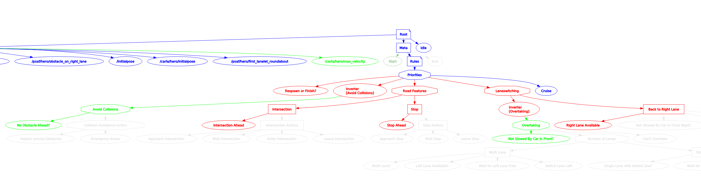

# Pytrees

**Summary:** pytrees is a python library used to generate and inspect decision trees. It has a very clear structure and is easy to understand, so it is used in this project.

---

## Author

Josef Kircher

## Date

31.01.2023

## Prerequisite

---
<!-- TOC -->
* [Pytrees](#pytrees)
  * [Author](#author)
  * [Date](#date)
  * [Prerequisite](#prerequisite)
  * [Getting started](#getting-started)
  * [What is Pytrees?](#what-is-pytrees)
  * [Examples](#examples)
  * [Common commands](#common-commands)
    * [Sources](#sources)
<!-- TOC -->
## Getting started

Pytrees is integrated in this project's dockerfile, so no setup is required.

## What is Pytrees?

Pytrees are in the middle of hierarchical finite state machines, task networks, scripting engines.
They allow for a good blend of purposeful planning towards goals with enough reactivity to shift in the presence of important events. They are also wonderfully simple to compose.

To get a better understanding of what Pytrees is and what it does please visit [Pytrees Wiki](http://docs.ros.org/en/noetic/api/py_trees/html/index.html)

## Examples

There is a very simple example for pytrees.

Run:

1. call `b5 update` to update docker container
2. call `b5 run` to start container
3. in a second shell call `b5 shell`
4. run `py-trees-demo-behaviour-lifecycle` to execute the example

## Common commands

Run rqt visualization for behaviour tree

`rqt --standalone rqt_py_trees.behaviour_tree.RosBehaviourTree`

Inspect data written to the behaviour tree

`rostopic echo /behavior_agent/blackboard`

Ascii representation of tree(not recommended)

`rostopic echo /behavior_agent/ascii/tree`

### Sources

<http://docs.ros.org/en/noetic/api/py_trees/html/index.html>
