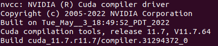

# Install cuda-toolkit

**Summary:** This page gives a short overview how to install cuda-toolkit on your computer.

---

## Author

Marco Riedenauer

## Date

10.01.2023

## First install

For execution of the program, cuda-toolkit v11.7 has to be installed on both, your computer and the docker container.
Cuda-toolkit should already be installed on the docker container by executing ```b5 install``` in your build folder:

For installing cuda-toolkit on your computer, execute step-by-step the following commands in your command line:

```text
wget https://developer.download.nvidia.com/compute/cuda/11.7.0/local_installers/cuda_11.7.0_515.43.04_linux.run
cd Downloads/
chmod +x <downloaded_filename>
sudo ./<downloaded_filename>
```

If cuda-toolkit is not found, add the path to `.bashrc` by appending the following text:

```text
export PATH="/usr/local/cuda-x.y/bin:$PATH"
export LD_LIBRARY_PATH="/usr/local/cuda-x.y/lib64:$LD_LIBRARY_PATH"
```

The path may be different depending on the system. You can get the path by executing ```which nvcc``` in the console.
You can find your installed version of cuda-toolkit by executing ```nvcc-version```. The output should look like this:



`release x.y` in the fourth column represents the version of the installed cuda-toolkit.

## Common Problems

### Wrong version of cuda-toolkit installed

If the installation does not work and the installer returns an "installation failed" message or during the installation
the installer outputs that already another version of cuda-toolkit is installed,
you have to uninstall the old version first.

This can be done by executing the file `cuda-uninstaller` in the installation folder, usually `/usr/local/cuda-x.y/bin`.

### Executing b5 install/update leads to an error of incompatible nvcc and drivers

I had this problem after reinstalling cuda-toolkit on my computer. The best workaround I found is to uninstall all
NVIDIA drivers and cuda-toolkit and reinstall both of them.
