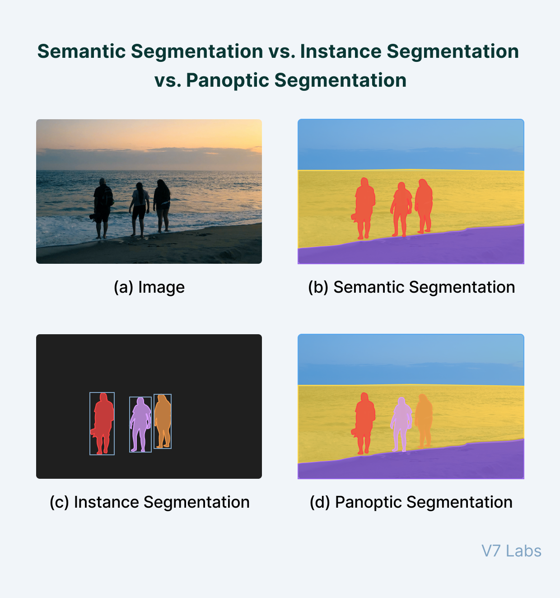

# First Implementation Plan

This document shows the initial ideas for the implementation of the perception module.
It includes the various detection and classification modules that are necessary for an efficient and reliable workflow.

---
## Authors

Marco Riedenauer

## Date

26.11.2022

---
<!-- TOC -->
* [First Implementation Plan](#first-implementation-plan)
  * [Authors](#authors)
  * [Date](#date)
  * [Overview](#overview)
  * [Panoptic Segmentation](#panoptic-segmentation)
    * [Things and Stuff](#things-and-stuff)
      * [Things](#things)
      * [Stuff](#stuff)
    * [Segmentation Overview](#segmentation-overview)
    * [Image Panoptic Segmentation](#image-panoptic-segmentation)
    * [LIDAR Panoptic Segmentation](#lidar-panoptic-segmentation)
  * [Position Validation](#position-validation)
  * [Obstacle Detection and Object Classification](#obstacle-detection-and-object-classification)
  * [Lane Detection](#lane-detection)
  * [Traffic Light Detection](#traffic-light-detection)
  * [Traffic Sign Detection](#traffic-sign-detection)
  * [Prediction](#prediction)
<!-- TOC -->

---
## Overview

---
## Panoptic Segmentation

### Things and Stuff

#### Things

In computer vision, the term things generally refers to objects that have properly defined geometry and are countable, like a person, cars, animals, etc.

#### Stuff

Stuff is the term used to define objects that don’t have proper geometry but are heavily identified by the texture and material like the sky, road, water bodies, etc.

### Segmentation Overview

There are three different kinds of image segmentation:
- **Semantic Segmentation**: \
    Classification of every pixel or point in an image or LIDAR map into different classes (car, person, street, ...)
- **Instance Segmentation**: \
    Detection of the different instances of things.
- **Panoptic Segmentation**: \
    Combination of semantic segmentation and instance segmentation. Detection of stuff plus instances of things.

[Source](https://www.v7labs.com/blog/panoptic-segmentation-guide)

### Image Panoptic Segmentation

Possible implementation with [EfficientPS](https://arxiv.org/pdf/2004.02307.pdf).
This net has a pretty high panoptic quality of 64-67% and a relatively low calculation time of 166ms on a 1024x2048 image.

###  LIDAR Panoptic Segmentation

**Discussion**: \
This is probably necessary to get also an overview about entities that are not in the field of view of the cameras 
like vehicles behind or next to the vehicle.

An efficient way to compute LIDAR panoptic segmentation is [EfficientLPS](https://arxiv.org/pdf/2102.08009.pdf) ([Website](http://lidar-panoptic.cs.uni-freiburg.de/)).
It has a panoptic quality between 53% and 59% and a calculation time of 154-213ms depending on the chosen architecture.

---
## Position Validation

If some positioning sensors show a significant deviation, the task of this module is to 
clear these deviations and to calculate the most accurate position possible.

---
## Obstacle Detection and Object Classification

This module is the first with a direct output into the planning layer. \
Its tasks are to combine the information given by the map, cameras, panoptic segmentation 
and LIDAR (panoptic segmentation).

A possible way for the combination of camera and LIDAR data is e.g. a projection between 
the semantic image and LIDAR points to generate a panoptic semantic LIDAR point cloud.

This enables to calculate bounding boxes for each thing and to get a precise overview about the surrounding stuff.

---
## Lane Detection

For lane detection, all occurring lines are classified (stop line, solid middle line, dashed middle line, etc.)
Based on this information, the lanes are classified (own lane, driveable, oncoming lane etc.). Information given by the
map are used either.

---
## Traffic Light Detection 

This module is responsible for the detection of traffic lights and the classification of their current state. \
It combines the information about position given by the map and Obstacle Detection and Object Classification Module and 
the information about the state given by the camera images.

For state classification, the part showing the traffic light is snipped out of the camera image to get a better and 
faster prediction due to a smaller image size and less information. To prevent the classification network to classify 
the state always as orange on traffic lights with orange housings, the housing is masked out.

Possible states are:
- green
- orange
- red
- off
- backside

---
## Traffic Sign Detection

This module is responsible for the detection of traffic signs and the classification of their state. \
It combines the information about position given by the map and Obstacle Detection and Object Classification Module and 
the information about the state given by the camera images.

For state classification, the part showing the traffic sign is snipped out of the camera image to get a better and 
faster prediction due to a smaller image size and less information. 

---
## Prediction
