# Grundrecherche im Planing

## Authors

Simon Erlbacher, Niklas Vogel

## Datum

15.11.2022

---
<!-- TOC -->
* [Grundrecherche im Planing](#grundrecherche-im-planing)
  * [Authors](#authors)
  * [Datum](#datum)
  * [PAF 2021-1](#paf-2021-1)
    * [Vehicle Controller](#vehicle-controller)
    * [Decision-Making-Component](#decision-making-component)
  * [PAF 2021-2](#paf-2021-2)
  * [PAF 2020 (1 & 2)](#paf-2020-1--2)
  * [Informationen aus alten Projekten](#informationen-aus-alten-projekten)
  * [Planning Unterteilung](#planning-unterteilung)
  * [Probleme](#probleme)
  * [Lokalisierung](#lokalisierung)
  * [Hindernisse erkennen](#hindernisse-erkennen)
  * [Sicherheitseigenschaften](#sicherheitseigenschaften)
  * [Decision Making (Behaviour Planner)](#decision-making-behaviour-planner)
  * [Trajektorie](#trajektorie)
  * [Trajektorie Tracking](#trajektorie-tracking)
  * [Offene Fragen aus dem Issue](#offene-fragen-aus-dem-issue)
    * [Was ist zu tun?](#was-ist-zu-tun)
    * [Eingang](#eingang)
    * [Ausgang](#ausgang)
    * [Wie sehen die Daten vom Leaderboard für das Global Planning aus](#wie-sehen-die-daten-vom-leaderboard-für-das-global-planning-aus)
    * [Daten aus dem LB und Global planning, wie kann daraus eine Trajektorie generiert werden](#daten-aus-dem-lb-und-global-planning-wie-kann-daraus-eine-trajektorie-generiert-werden)
    * [Wie sieht die Grenze zwischen global und local plan aus?](#wie-sieht-die-grenze-zwischen-global-und-local-plan-aus)
    * [Müssen Staus umfahren werden?](#müssen-staus-umfahren-werden)
    * [Sollgeschwindigkeitsplanung](#sollgeschwindigkeitsplanung)
<!-- TOC -->

## [PAF 2021-1](https://github.com/ll7/paf21-1)

### Vehicle Controller

Ausgabe dieser Komponente ist ein "DrivingSignal" bestehend aus einer Sollgeschwindigkeit und einem Lenkwinkel.
Außerdem ist der Controller dazu in der Lage Kurven zu detektieren und eine Geschwindigkeit zu errechnen mit der diese durchführbar ist.

Während die Geschwindigkeit des Fahrzeuges mittels einer vergleichsweise simplen PID Regelung vom Ackermann-Controller kontrolliert wird,
besteht die Steuerung des Lenkwinkels aus zwei Teilkomponenten. Dabei wird auf Geraden auf den sogenannten "Stanley-Controller"
und in Kurven auf einen "NaiveSteeringController" zurückgegriffen.

Der naive Controller berechnet mithilfe der aktuellen Fahrzeug-Position und dem nächsten Wegpunkt zunächst einen Soll-Orientierungsvektor.
Anschließend wird durch Hinzunahme der Ist-Orientierung der Lenkwinkel kalkuliert. Der Stanley Controller berechnet den Lenkwinkel mithilfe des "crosstrack error" und des "heading error".

Die Kurvendetektion berechnet die maximale Kurvengeschwindigkeit durch Ermittlung des Kurvenradius der gegebenen Trajektorie mithilfe des Dreiecksumfangs:

Inputs:

* Fahrzeugposition
* Fahrzeugorientierung
* Fahrzeuggeschwindigkeit
* Fahrtrajektorie

Outputs:

* Sollgeschwindigkeit
* Lenkwinkel

### Decision-Making-Component

Gestartet mit Finite State Machines mit klaren Zuständen und Regeln für Übergänge.
Führte zu soliden Ergebnissen bei korrekten Inputs. Wurde erweitert zur Markov Kette, um reinforcement learning Ansätze auszuprobieren. (Leider kein Fazit dazu zu finden)

Finite-state machine für Geschwindigkeitskontrolle:

Finite-state machine für Manöver:

Inputs:

* Geschwindigkeit
* Objekt auf Trajektorie
* Ampelsignale
* Geschwindigkeitsbegrenzung
* Geschwindigkeit und Position anderer Verkehrsteilnehmer
* Target Lane

Outputs:

* "Actions" (Bremsen, Beschleunigen, Halten, Spurwechsel...)

Globaler Planer Überblick:

## [PAF 2021-2](https://github.com/ll7/paf21-2)

verantwortlich für die Routenplanung und Pfadplanung für das Ego-Vehicle sowie die erkannten Verkehrsteilnehmer.

* global_planner
  * Planung einer Route von einem Startpunkt zu einem oder einer Liste an Zielpunkten
  * Commonroad Route Planner (TUM) -> Liste an Routen-Lanelets sowie eine Liste an Punkten mit Abstand etwa 10cm
  * Anreicherung mit parallelen Spuren
* local_planner
  * Lokale Pfadplanung inklusive Spurwahl, Ampelmanagement und Spurwechsel
  * erlaubte Geschwindigkeit, sowie die bevorzugte Spur basierend auf der Hinderniserkennung (obstacle planner) wird ergänzt
  * "beste"/schnellste Möglichkeit wird errechnet und weiter an acting geschickt
* obstacle_planner
  * Verwaltung von dynamischen hindernissen
  * Vorhersage von Pfaden anderer Fahrzeuge und generieren von Folgefahrzeug-Informationen
  * Verwerfen von "irrelevanten" Fahrezeugen

* Geschwindigkeitsplanung/Kontrolle wie 2021-1 + Bremswegplanung [Details](https://github.com/ll7/paf21-2/tree/main/paf_ros/paf_planning#bremsweg)
* Map Manager für die Verwaltung aller statischen Kartendaten

## PAF 2020 ([1](https://github.com/ll7/psaf1) & [2](https://github.com/ll7/psaf2))

PAF 2021 basiert auf 2020 daher wurde brauchbares größtenteils bereits übernommen.
So hat 2020-1 starke Analogien zu 2021-1 mit u.a. State Machine zur Entscheidungsfindung, Geschwindigkeits und Lenkwinkelplanung.

2020-2 dagegen benutzt statt State Machine ein Decision Tree zur Entscheidungsfindung:

Teilbaum "Intersection" als Beispiel:

"If there is a Intersection coming up the agent executes the following sequence of behaviours:

* Approach Intersection
  * Slows down, gets into the right lane for turning and stops at line
* Wait at Intersection
  * Waits for traffic lights or higher priority traffic
* Enter Intersection
  * Enters the intersection and stops again, if there is higher priority oncoming traffic
* Leave Intersection
  * Leaves the intersection in the right direction"

[Kompletter Entscheidungsbaum](https://github.com/ll7/psaf2/tree/main/Planning/behavior_agent)

## Informationen aus alten Projekten

Quellen:

* <https://arxiv.org/pdf/2010.12598.pdf>
* <https://www.shuffleai.blog/blog/Simple_Understanding_of_Kinematic_Bicycle_Model.html>

Übersicht zu einer möglichen Architektur (Gewinnerteam des ersten Wettbewerbes)

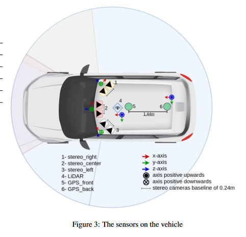

Mögliche Anordnung und Anzahl von Sensoren. (6 Kameras, 1 LIDAR, 2 GPS)

## Planning Unterteilung

Planning Übersicht

## Probleme

* Kollision mit statischen Objekten (Gehsteig)
* Kollision mit Fußgängern die unerwartetes Verhalten zeigen

Es wird vorgeschlagen ein festes Notfallmanöver für das Fahrzeug zu erstellen, welches mit einer schnelleren Reaktionszeit greift, um unerwartete Kollisionen zu verhindern.

## Lokalisierung

Die Position des Fahrzeuges kann durch die zwei GPS Tracker bestimmt werden und wird in einem Vektor abgelegt.
Alt steht hierbei für altitude und beschreibt die gemessene Höhe durch die GPS Tracker.
Der Winkel gibt hierbei die Orientierung des Fahrzeuges an. Der x und y Wert beinhaltet die Koordinaten des hinteren GPS Trackers.

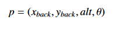 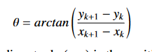

Positionsvektor und Berechnung des Fahrzeugwinkels zur Zielposition

Die Position kann somit in Ab hängigkeit von dem GPS Signal erstellt werden.
Wenn das GPS Signal allerdings fehlerhaft ist bzw. Störungen ausgesetzt ist, gibt es Probleme mit der Positionsbestimmung.
In diesem Fall wird ein Kalman Filter impolementiert.
Er kommt mit Störungen zurecht und gibt auf Basis der aktuellen Position eine gute Vorhersage für zukünftige Zustände des Fahrzeuges.

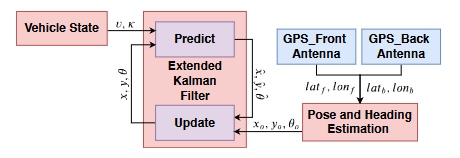

Berechnung der aktuellen und zukünftigen Fahrzeugposition

## Hindernisse erkennen

Mit dem LIDAR Sensor werden Punktewolken in der Umgebung erzeugt.
Diese werden mit dem DBSCAN Algorithmus geclustert. Er kommt gut mit outlinern klar und kann diese entsprechend ignorieren.
Mit Calipers Algorithmus aus der OpenCV Bibliothek wird für jedes Cluster das kleinst mögliche Rechteck, welches das Cluster fitted, erzeugt.

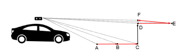

Erkennen von Hindernissen mit dem LIDAR Sensor

Mit dem LIDAR Sensor gibt es jetzt die Möglichkeit das Hinderniss (Punktewolke) zu erkennen.
Es werden feste Punkte ABCDEF bestimmt in unterschiedlichen Abständen.
Das Skalarprodukt zwischen AB und BC ist in dem Bild nahe 1.
Der Winkel ist somit nahe an 0. Der Winkel zwischen BC und CD hingegen geht Richtung 90 Grad.
Das Skalarprodukt ist hiermit nahe 0. Es wurde also ein Hinderniss erkannt. Der Winkel zwischen DE und DF ist auch nahe 0.
Dies soll einen Outliner darstellen. Druch das Einführen eines Thresholds können diese Detektionen ausgeschlossen werden.

Hindernisse mit dem Occupacy Grid erkennen. Somit einfach Abstand der Punkte in einer Gridzelle mit dem Mittelpunkt eines Kreises berechnen und prüfen ob die Distanz kleiner als der Radius ist.

360 Grad Occupacy Grid

Approximation eines Fahrzeuges mit drei Kreisen

Einfache Berechnung einer Kollision

## Sicherheitseigenschaften

Wichtig ist die Sicherheitseigenschaft von Autonomen Fahrzeugen. Risiken können in drei KLassen unterteilt werden:

* Kollision mit statischen Objekten
* Kollision mit dynamischen Objekten
* Kollision mit unerwarteten Objekten

In dem Beispielprojekt wurde eine Bewertung der Überlappung von Trajekotrien verschiedener Objekte zur HAnd genommen.
Es wird eine mögliche Kollisionszone bestimmt. Das Fahrzeug hat hierbei drei Zonen auf seiner Trajektorie.

* Danger Zone: Hier muss sofort gestoppt werden wenn ein Trajektorien Konflikt detektiert wird
* Warning Zone: Hier entsprechend die Geschwindigkeit anpassen im Verhältnis zu der DTC (distance to collision)
* Safe Zone

Die Kollision benötigt die Position eines möglichen Kollisionsgegenstandes und seine Form.
Wenn die Orientierung und die Geschwindigkeit verfügbar sind, kann eine Vorhersage zu der zukünftigen Position getroffen werden, um Konflikte zu vermeiden.
Ist das nicht vorhanden, wird nur die Nähe des Objektes zur Hand genommen und ein Threshold Wert (in diesem Projekt 1m).
Annahme: Alle Verkehrsteilnehmer haben konstante Geschwindigkeit (sonst Berechnungsaufwand zu hoch)

## Decision Making (Behaviour Planner)

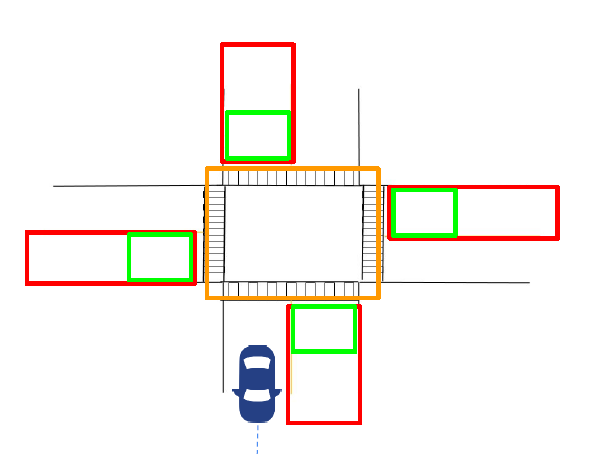

Verkehrsszenario einer Kreuzung mit verschiedenen Zonen.

* Roter Bereich: Fahrzeug verlangsamt seine Geschwindigkeit
* Grüner Bereich: Fahrzeug kommt zum stehen
* Oranger Bereich (Intersection): Fahrzeug betritt diesen Bereich nur,wenn kein anderer Verkehrsteilnehmer in diesem erkannt wird
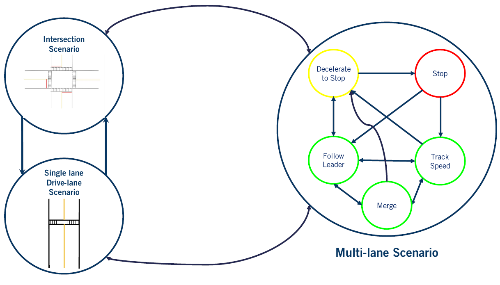

Aufteilung in mehrere state machines

Eine state machine oder Aufteileung in mehrere state machines
Vorteile von mehreren state machines:

* Geringere Berechnungszeit
* einfacher zu erstellen und Instand zu halten

Nachteile von mehreren state machines:

* Sehr viele Regeln
* Regeln zwischen state machines können sich wiederholen

Reinforcement Learning, Rule based System, Markov Decision Process

## Trajektorie

Die Trajekotrie wird durch Wegpunkte bestimmt, welche zwischen dem Start- und Endpunkte berechnet werden.
Dieser Weg wird durch eine Cubic Spline interpoliert.
Probleme ist hierbei das Umplanen der Trajekotrie durch unerwartete Hindernisse (Gegenverkehr, Fußgänger,...).
Das Fahrzeug muss seine zukünftigen Aktionen, eigene Zustandsübergange, Zustandsübergänge anderer Agenten einbeziehen (zB. Umschalten einer Ampel).
Es wird ein Input Vektor aus dem Bycicle Modell benötigt.

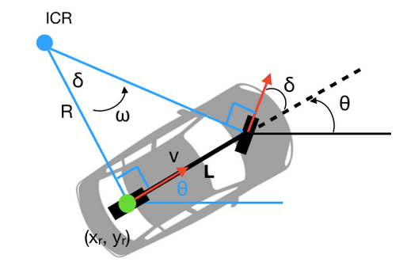

Modell für die Berechnung der aktuellen und zukünftigen Fahrzeugposition

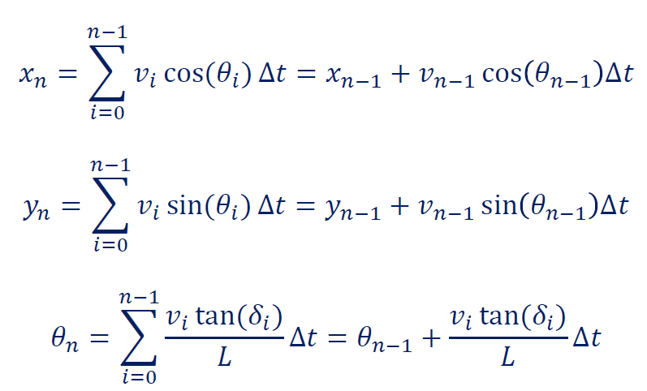

Berechnung einer Trajektorie

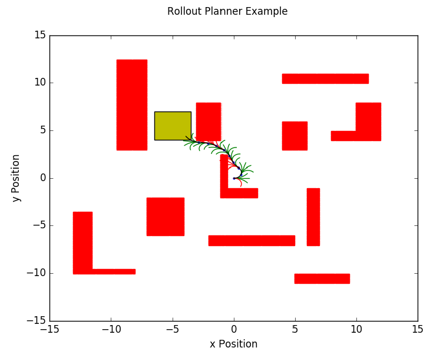

Visualisierung des Optimierungsprozesses bei der Trajektorienbildung

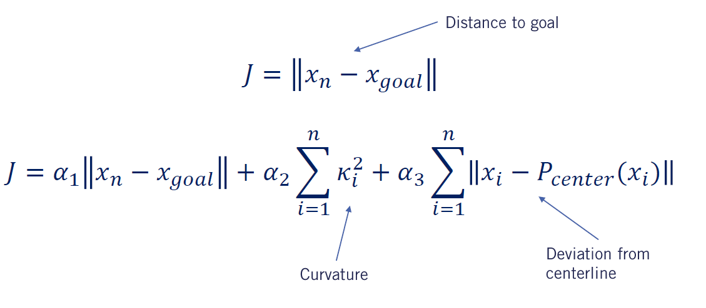

Fehlerminimierung bei der Trajektorienberechnung

## Trajektorie Tracking

* Stanley Controller
* Pure Pursuit Controller

## Offene Fragen aus dem [Issue](https://github.com/ll7/paf22/issues/26)

### Was ist zu tun?

2020-1: "Die Hauptaufgabe des Local Planner ist das Berechnen einer Geschwindigkeits- und einer Lenkwinkelvorgabe für das Fahrzeug.
Die Entscheidung zur Festlegung dieser Vorgaben wird dabei anhand der zur Verfügung stehenden Informationen wie beispielsweise der Globalen Route (Geschwindigkeit auf Streckenabschnitten) oder der Perception (Ampeln, Stoppschilder) geschehen.
Dabei werden andere Fahrzeuge im näheren Umfeld des eigenen Fahrzeugs auch in diese Planung einbezogen. Des Weiteren entscheidet der Local Planer auch auf Basis der Informationen, ob eine Neuplanung des GlobalPlanners ausgelöst werden soll."

### Eingang

* Fahrzeugposition
* Fahrzeugorientierung
* Fahrzeuggeschwindigkeit
* Fahrtrajektorie bzw anzufahrende Punkte aus denen trajektorie errechnet werden kann
* Objekte auf Trajektorie
* Ampelsignale und Verkehrsschilder
* Geschwindigkeitsbegrenzung
* Geschwindigkeit und Position anderer Verkehrsteilnehmer
* Target Lane

### Ausgang

* "Actions"
  * Bremsen
  * Beschleunigen
  * Halten
  * Spurwechsel
  * ...

Oder

* Sollgeschwindigkeit
* Lenkwinkel

### Wie sehen die Daten vom Leaderboard für das Global Planning aus

"For each route, agents will be initialized at a starting point and directed to drive to a destination point, provided with a description of the route through GPS style coordinates, map coordinates and route instructions."

* GPS coordinates Beispiel:
  * {'z': 0.0, 'lat': 48.99822669411668, 'lon': 8.002271601998707}
* Map/World coordinates Beispiel:
  * {'x': 153.7, 'y': 15.6, 'z': 0.0}
* Route Instructions:
  * RoadOption.CHANGELANELEFT: Move one lane to the left.
  * RoadOption.CHANGELANERIGHT: Move one lane to the right.
  * RoadOption.LANEFOLLOW: Continue in the current lane.
  * RoadOption.LEFT: Turn left at the intersection.
  * RoadOption.RIGHT: Turn right at the intersection.
  * RoadOption.STRAIGHT: Keep straight at the intersection.

"The distance between two consecutive waypoints could be up to hundreds of meters. Do not rely on these as your principal mechanism to navigate the environment."

"There might be cases where the semantics of left and right is ambiguous. In order to disambiguate these situations, you could consider the GPS position of the next waypoints."

Des Weiteren steh als globale Map ein OpenDRIVE file als String geparsed zur Verfügung.

### Daten aus dem LB und Global planning, wie kann daraus eine Trajektorie generiert werden

[Beispiel 2021-2](#paf-2021-2):

* global_planner (Planung einer Route von einem Startpunkt zu einem oder einer Liste an Zielpunkten)
  * Commonroad Route Planner (TUM) -> Liste an Routen-Lanelets sowie eine Liste an Punkten mit Abstand etwa 10cm
  * (Anreicherung mit parallelen Spuren)

### Wie sieht die Grenze zwischen global und local plan aus?

Globaler Plan beschreibt eine vorläufige Route von Startpunkt zu/durch Zielpunkt(e).

Lokaler Plan adaptiert den globalen Plan, um schneller zu sein (Überholvorgang) oder um auf Hindernisse oder lokale "Verkehrsregeln" reagieren zu können (umfahren, abwarten, kein Unfall bauen, keine Ampel/Schilder überfahren...).

### Müssen Staus umfahren werden?

Abweichen von der Vorgegeben Route wird bestraft also nein nicht umfahren.

"Additionally, some events will interrupt the simulation, preventing the agent to continue. In these cases, the route which is being simulated will be shut down, and the leaderboard will move onto the next one, triggering it normally.

Route deviation — If an agent deviates more than 30 meters from the assigned route."

### Sollgeschwindigkeitsplanung

* Schilder
  * vor Ampeln, Schildern, Kreisverkehren, Kreuzungen verzögern und langsamer werden
* Kurvenfahrt
  * siehe [maximale Kurvengeschwindigkeit](#vehicle-controller)
* Vorausfahrendes Auto
  * Geschwindigkeit an dieses Anpassen oder überholen wenn möglich
* Straßenverhältnisse
  * "variety of situations: including freeways, urban areas, residential districts and rural settings"
  * "variety of weather conditions: including daylight scenes, sunset, rain, fog, and night, among others"
