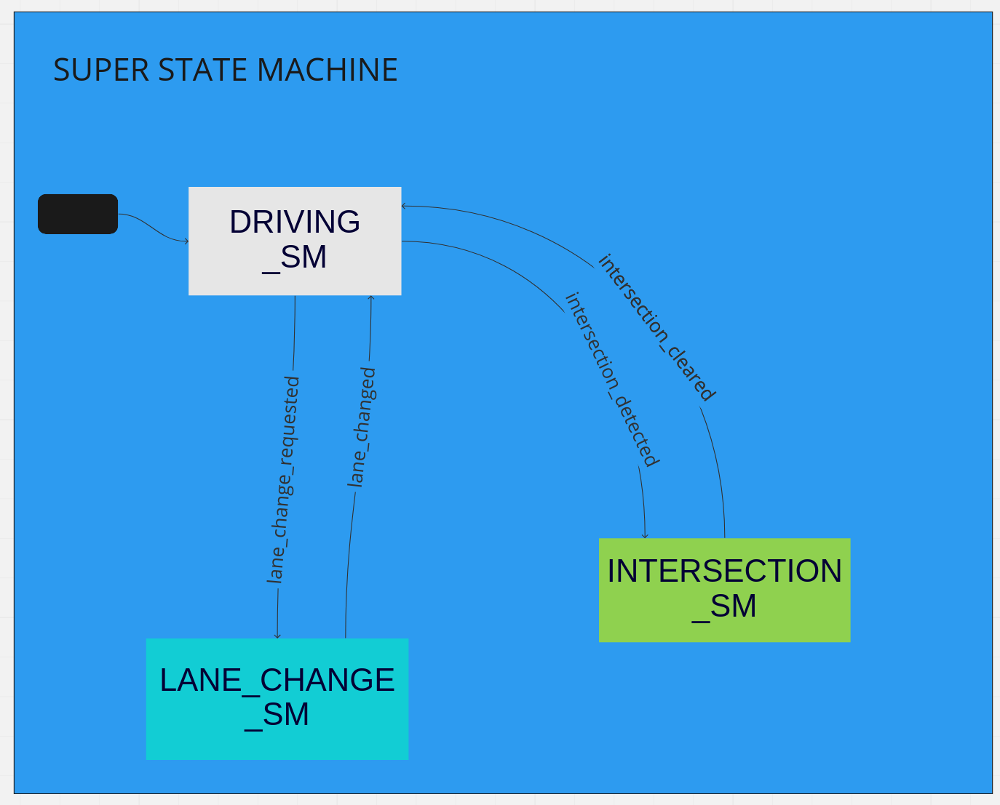
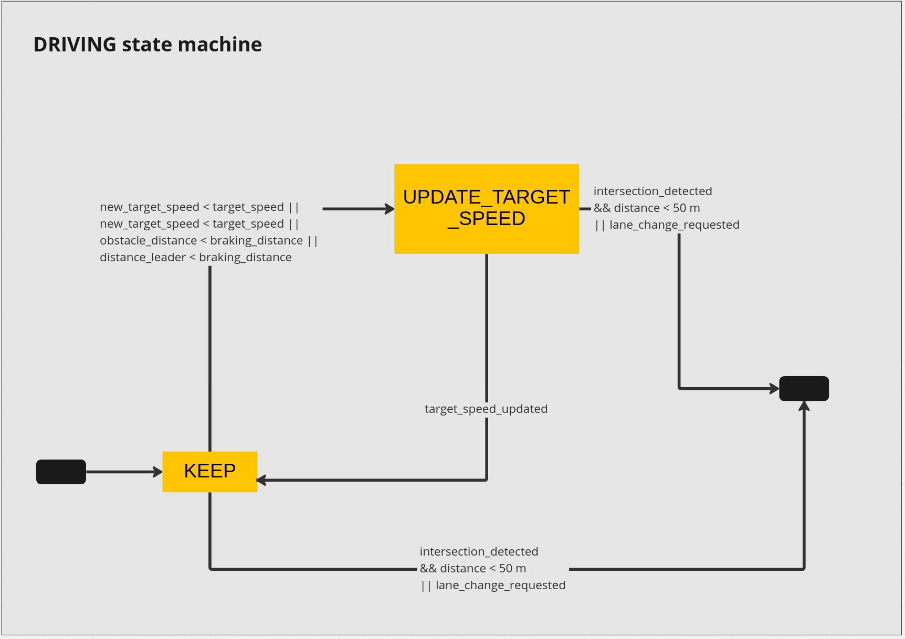
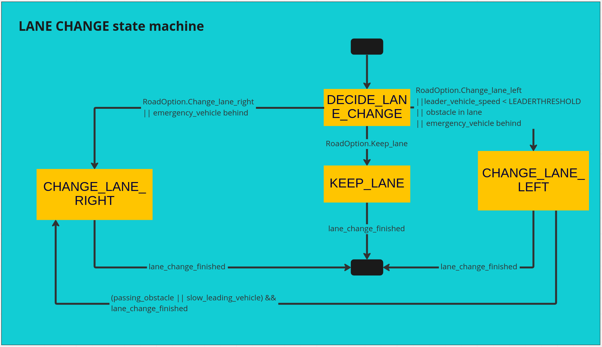
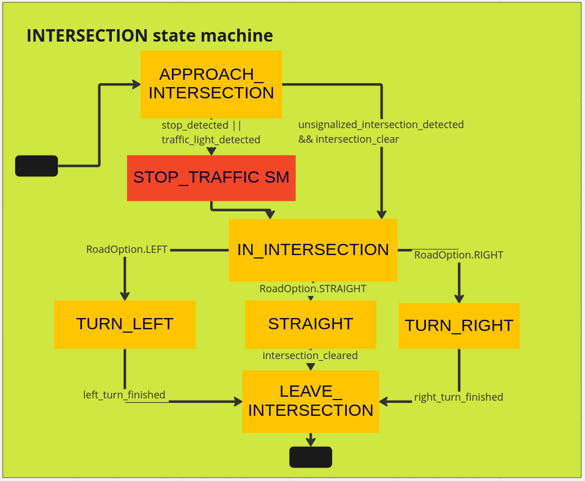
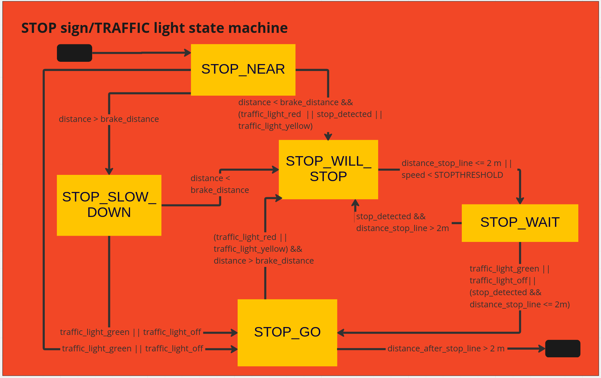

# State machine design

**Summary:** This page gives an overview of the design of the state machine and further describes states and transitions.

---

## Author

Josef Kircher

## Date

09.12.2022

---
<!-- TOC -->
* [Title of wiki page](#title-of-wiki-page)
  * [Author](#author)
  * [Date](#date)
  * [Super state machine](#super-state-machine)
  * [Driving state machine](#driving-state-machine)
    * [KEEP](#keep)
    * [ACCEL](#accel)
    * [Brake](#brake)
  * [Lane change state machine](#lane-change-state-machine)
    * [DECIDE_LANE_CHANGE](#decidelanechange)
    * [CHANGE_LANE_LEFT](#changelaneleft)
    * [CHANGE_LANE_RIGHT](#changelaneright)
  * [Intersection state machine](#intersection-state-machine)
    * [APPROACH_INTERSECTION](#approachintersection)
    * [IN_INTERSECTION](#inintersection)
    * [TURN_LEFT](#turnleft)
    * [STRAIGHT](#straight)
    * [TURN_RIGHT](#turnright)
    * [LEAVE_INTERSECTION](#leaveintersection)
  * [Stop sign/traffic light state machine](#stop-signtraffic-light-state-machine)
    * [STOP_NEAR](#stopnear)
    * [STOP_SLOW_DOWN](#stopslowdown)
    * [STOP_WILL_STOP](#stopwillstop)
    * [STOP_WAIT](#stopwait)
    * [STOP_GO](#stopgo)
  * [Implementation](#implementation)
    * [Sources](#sources)
<!-- TOC -->

## Super state machine

The super state machine functions as a controller of the main functions of the agent.

Those functions are

* following the road and brake in front of obstacles if needed
* drive across an intersection
* change lane

## Driving state machine

Transition:

* From `Intersection state machine`
* From `Lane change state machine`

This state machine controls the speed of the ego-vehicle. It either tells the acting part of the ego vehicle to `UPDATE_TARGET_SPEED` or `KEEP` the velocity.

This is assumably the main state of the state machine as the ego vehicle will most of the time follow the road.

If there is an event requiring the ego-vehicle to change the lane as mentioned in [Lane change state machine](#lane-change-state-machine), the lane change requested transition is triggered.

### KEEP

Transition:

* From `UPDATE_TARGET_SPEED`

Keep the current target speed, applied most of the time. From here changes to the `UPDATE_TARGET_SPEED` state are performed, if events require a change of `target_speed`.

### UPDATE_TARGET_SPEED

Transition:

* From `KEEP` if `new target_speed` is smaller or greater than current `target_speed` or an `obstacle` or the `leading_vehicle` is in braking distance.

Set a new target speed and change back to `KEEP` state afterwards.

## Lane change state machine

Transition:

* From `driving state machine` by `lane_change_requested`

This state machine completes the change of a lane. This is triggered from the super state machine and can have multiple triggers. Those include:

* Join highway
* Leave highway
* RoadOption:
  * CHANGELANELEFT
  * CHANGELANERIGHT
  * KEEPLANE
* avoid obstacle(doors, static objects)
* give way to emergency vehicle
* overtake slow moving vehicle
* leave a parking bay

### DECIDE_LANE_CHANGE

Transition:

* From super state machine by above triggers

From the super state machine the transition to change the lane is given by one of the above triggers. This state decides to which lane should be changed dependent on the trigger.
It takes into account if there are lanes to the left and/or right and if the lane change is requested by a roadOption command.

### CHANGE_LANE_LEFT

Transition:

* From `DECIDE_LANE_CHANGE` by `RoadOption.CHANGELANELEFT` or `obstacle_in_lane` or `leader_vehicle_speed < LEADERTHRESHOLD`

This state performs a lane change to the lane on the left.

If the lane is for oncoming traffic, it should be checked if there is enough time to complete two lane changes plus a buffer for the length of an obstacle without an accident.

If the lane is for traffic flowing in the same direction, It should be checked if the lane is free and if there is no faster moving vehicles coming from behind.

If an obstacle or a slow leading vehicle are the reasons for the lane change, to join the same lane after the obstacle is passed, the state changes to `CHANGE_LANE_RIGHT`.

### CHANGE_LANE_RIGHT

Transition:

* From `DECIDE_LANE_CHANGE` by `RoadOption.CHANGELANERIGHT` or `emergency_vehicle_in_front`
* From `CHANGE_LANE_LEFT` by `passing_obstacle` or `slow_leading_vehicle`

For changing to the right lane it is assumed, that the traffic in this lane flows in the driving direction of the ego vehicle.

The lane change should be performed if the lane is free and there are no fast moving cars behind us that would crash with the ego vehicle.

## Intersection state machine

Transition:

* From `driving state machine` by `intersection_detected`

This state machine handles the passing of an intersection.

### APPROACH_INTERSECTION

Slow down in the approach of an intersection.

If the intersection is `unsignalized` and `clear` change to the `ENTER_INTERSECTION` state.

If there are is a traffic light or a stop sign at the intersection change to the stop_sign/traffic state machine.

### IN_INTERSECTION

Transition:

* From `STOP_SIGN/TRAFFIC SM` by `clearing the traffic light, stop sign`
* From `APPROACH_INTERSECTION` by `detecting an unsignalized and cleared intersection`

After the approach of the intersection and clear a possible traffic light/stop sign, the ego vehicle enters the intersection.

From there the RoadOption decides in which direction the ego vehicle should turn.

### TURN_LEFT

Transition:

* From `IN_INTERSECTION` by `RoadOption.LEFT`

Check for pedestrians on the driving path. If the path is clear of pedestrians, make sure there will be no crashes during the turning process with oncoming traffic.

### STRAIGHT

Transition:

* From `IN_INTERSECTION` by `RoadOption.STRAIGHT`

Check if there is a vehicle running a red light in the intersection. Pass the intersection.

### TURN_RIGHT

Transition:

* From `IN_INTERSECTION` by `RoadOption.RIGHT`

Check for pedestrians on the driving path. If the path is clear of pedestrians, make sure there will be no crashes during the turning process with crossing traffic.

### LEAVE_INTERSECTION

Transition:

* From `TURN_RIGHT`, `STRAIGHT` or `TURN_LEFT` by passing a distance from the intersection.

## Stop sign/traffic light state machine

Transition:

* From `APPROACH_INTERSECTION` by `stop_sign_detected or traffic_light_detected`

This state machine handles the handling of stop signs and traffic lights.

### STOP_NEAR

If the traffic light/stop sign is near, reduce speed. Avoid crashes with slowly leading vehicles.

### STOP_SLOW_DOWN

Transitions:

* From `STOP_NEAR` if `distance greater braking distance`.

Slow down near the traffic light to be able to react to quick changes.

### STOP_WILL_STOP

Transition:

* From `STOP_NEAR` if `distance < braking distance` while sensing a traffic_light that is `red` or `yellow` or a `stop sign`
* From `STOP_SLOW_DOWN` if `distance < braking distance`
* From `STOP_GO` if the traffic light changes from `green` to `yellow` or `red` and the ego vehicle can stop in front of the stop sign/traffic light.
* From `STOP_WAIT` if the there is a predominant stop sign and the ego vehicle didn't reach the stop line.

Stop in front of the traffic light or the stop sign.

### STOP_WAIT

Transition:

* From `STOP_WILL_STOP` by either vehicle has stopped or distance to stop line is less than 2 meters

The vehicle has stopped and waits eiter until leading vehicle continues to drive or traffic rules permit to continue driving.

### STOP_GO

Transition:

* From `STOP_NEAR` if traffic light is `green` or `off`
* From `STOP_SLOW_DOWN` if traffic light is `green` or `off`
* FROM `STOP_WAIT` if traffic light is `green` or `off`

Ego vehicle starts to accelerate to clear the traffic sign/traffic light or continues to drive if the traffic light is green or deactivated.

If the distance after the stop line is greater than 2 meters the state machine is left.

## Implementation

The implementation of the state machine at this point is planned to be achieved with `SMACH`, a maintained python library that has an easy and intuitive syntax and also support nested state machines which will helpful
for implementing the super state machine and the stop_sign/traffic light state machine.

A final decision will be made after minimal viable state machine is implemented with this library and tested with the minimal viable vehicle.

### Sources

<https://github.com/ll7/paf21-1/wiki/Decision-Making-Component>

<https://github.com/ll7/psaf1/tree/master/psaf_ros/psaf_local_planner>

<http://wiki.ros.org/smach>
