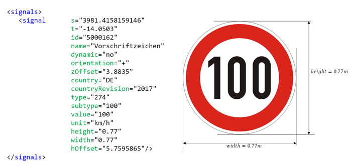
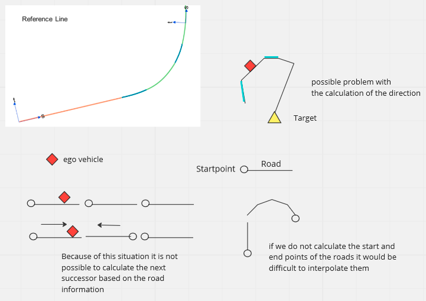
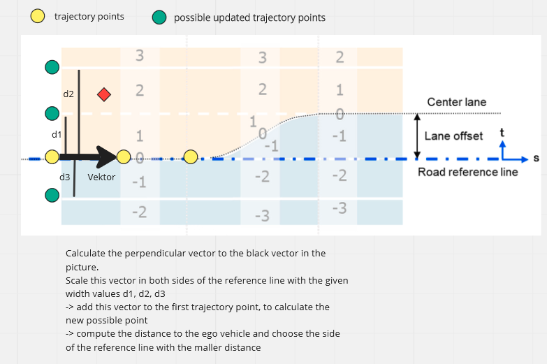
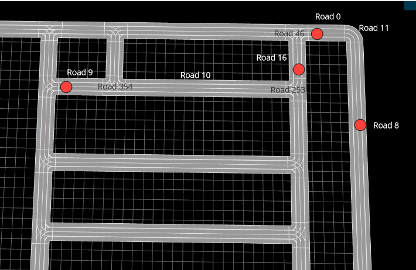
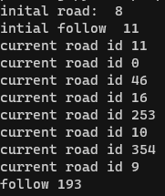
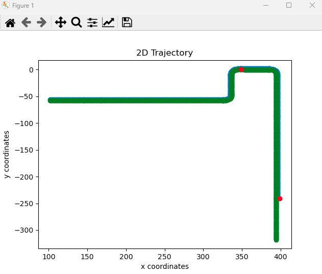
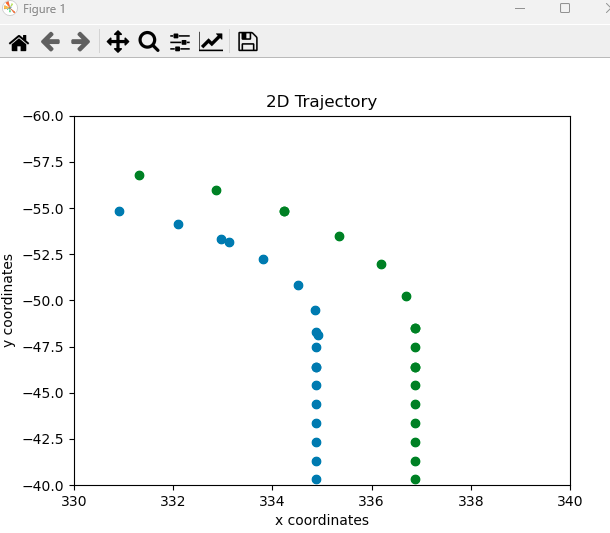

# OpenDrive Format

**Summary:** Evaluate the reading of the OpenDrive map in other projects and outline recommended further steps.

---

## Authors

Simon Erlbacher

### Date

10.01.2023

---

<!-- TOC -->
* [OpenDrive Format](#opendrive-format)
  * [Authors](#authors)
    * [Date](#date)
  * [General](#general)
  * [Different Projects](#different-projects)
    * [PSAF1](#psaf1)
    * [PSAF2](#psaf2)
    * [paf21-2](#paf21-2)
    * [paf21-1](#paf21-1)
    * [Result](#result)
  * [More information about OpenDrive](#more-information-about-opendrive)
    * [Start of the implementation](#start-of-the-implementation)
    * [Implementation details](#implementation-details)
  * [Follow-up Issues](#follow-up-issues)
  * [Sources](#sources)
<!-- TOC -->

## General

The OpenDrive format provides a common base for describing road networks with extensible markup language (XML) syntax,
using the file extension xodr. The data that is stored in an ASAM OpenDRIVE file describes the geometry of roads, lanes
and objects, such as roadmarks on the road, as well as features along the roads, like signals
(traffic lights, stop signs,...). It is based on real and synthetic data.

## Different Projects

It is examined how the OpenDrive file is converted and read in other groups and projects.

### PSAF1

* Subscribed the OpenDrive information from the Carla Simulator
* Used the Commonroad Route Planner from TUM (in the project they used the now deprecated verison)
* This Route Planner converts the xdor file from the CarlaWorldInfo message automatically
* As a result they used a Lanelet model, which they enriched with additional information about
traffic lights and traffic signs
* This additional information comes from the Carla Simulator API

Result: We can't use this information from [psaf1]("https://github.com/ll7/psaf1/tree/master/psaf_ros/psaf_global_planner")
, because it is not allowed to use privileged information from the Carla Simulator

### PSAF2

* Same approach as described in PSAF1 above
* Same problem in [psaf2](https://github.com/ll7/psaf2/tree/main/Planning/global_planner) with this approach as
  mentioned in PSAF1

### paf21-2

* Same approach as described in PSAF1 above
* Same problem in [paf21-2](https://github.com/ll7/paf21-2#global-planner) with this approach as mentioned in PSAF1

### paf21-1

* Worked directly with the OpenDrive format
* There is a lot of information available
* They extracted some information from the xdor file to plan their trajectory
* They don't recommend to use this approach, because a lot of "black magic" is happening in their code

Result: The only possible way to get all the road information without using the Carla Simulator API

### Result

The Commonroad Route Planner can be used to convert the xdor file and generate a Lanelet Modell from it. But from
experiences with this tool, it is not recommended to use it. The planer loses a alot of information about the map
during the planning process. It would be better to convert and analyse the xdor file directly.

## More information about OpenDrive

* We can read the xdor file with the [ElementTree XML API](https://docs.python.org/3/library/xml.etree.elementtree.html)
* We can refactor the scripts from paf21-1 but as they described, it is a lot of code and hard to get a good
overview about it
* Also we have a different scenario, because we do not need to read the whole xdor file in the beginning. We need
to search for the relevant area
* The OpenDrive format contains a lot of information to extract
  * Every road section has a unique id
  * Road has a predecessor and a successor with its specific type (road, junction,...)
  * Information about signals and their position
  * Information about the reference lines (line which seperates lanes) and their layout (linear, arc, cubic curves)
  * Information about the maximum speed
  

Impression of the format
  
There are a lot of infomrations in the file. Also a lot of information, which is not relevant for our project.
For the next steps i recommend to read the file and in the first steps to find the road id where the agent is located
and the following roads required to reach the goal position.
Then we need to create the trajectory points from the agent to the goal position.
After that, we can add some more information about the signals to our trajectory.

### Start of the implementation

structure of the xodr files from the Simulator:

* header
* road (attributes: junction id (-1 if no junction), length, road id, Road name)
  * lanes
  * link (predecessor and successor with id)
  * signals
  * type (contains max speed)
  * planView (contains information about the geometry and the line type (= reference line))
* controller (information about the controlled signals)
* junction (crossing lane sections)

link:

* every road has a successor and a predecessor road (sometimes only one of them)
* the road can have the type "road" or "junction"
* we can access the relevant sections with an id value
* Example:

      <link>
          <predecessor elementType="road" elementId="11" contactPoint="start"/>
          <successor elementType="junction" elementId="26"/>
      </link>

planView:

* x and y world coordinates (startposition of the reference line)
* hdg value for the orientation
* length value for the length of this road section (reference line)
* reference line type: line, curvature (more possible in Asam OpenDrive)

      <planView>
          <geometry s="0.0000000000000000e+0" x="1.4496001044438231e+2" y="4.5530173674054729e-2" hdg="3.1414859243253437e+0" length="4.1771856710381215e+1">
              <line/>
          </geometry>
          <geometry s="4.1771856710381229e+1" x="1.0318815397191554e+2" y="4.9988453207001515e-2" hdg="3.1414859243253437e+0" length="2.1631953836864781e-1">
              <arc curvature="2.0000000000000000e-3"/>
          </geometry>
          <geometry s="4.1988176248749852e+1" x="1.0297183443653296e+2" y="4.9964746689786163e-2" hdg="-3.1412667437776545e+0" length="2.8182375125015824e-1">
              <line/>
          </geometry>
      </planView>

lane:

* a lane is part of a road
* road can consists of different lanes
* the lane next to the reference line has the value 1
* the lanes next to that lane have increasing numbers
* lanes on the left and on the right side of the reference line have different signs

junction:

* a road section with crossing lanes
* a junction has one id
* every segment in the junction connects different lanes
* every connection has its own id

      <junction id="194" name="junction194">
          <connection id="0" incomingRoad="19" connectingRoad="195" contactPoint="end">
              <laneLink from="1" to="1"/>
          </connection>
          <connection id="1" incomingRoad="12" connectingRoad="197" contactPoint="start">
              <laneLink from="-2" to="2"/>
              <laneLink from="-3" to="1"/>
          </connection>
      </junction>

Relevant coordinate system:

* inertial coordinate system
  * x -> right (roll)
  * y -> up (pitch)
  * z -> coming out of the drawig plane (yaw)

Driving direction:

* calculate on which road the agent drives
* that has an impact on the way we have to calculate the end points
* A road is decribed through the reference line. Every road segment has a
starting point and a length value. The distance to the following road segment.
The calculation of the trajectory uses the startpoint of the next road segment
to navigate along the street. If the agent drives on the other side of the street,
than this reference points have to be calculated different.
-> The driving direction has to be checked at the beginning and compared to the
the start points of the reference line

### Implementation details

There are two methods to calculate the trajectory. The first method is only needed once
at the beginning, when the ego-vehicle stays at its start position.

* First we need to find the current road, where the agent is located
* Take all road start points and calculate the nearest startpoint to the vehicle position
* Calculate Endpoint for each connecting road and check if the vehicle lays in the interval -> road id
  * use the predecessor and the successor points to get the correct road
  * also check if the predecessor or successor is a junction. If do not have a command from the leaderboard we pass
  the junction straight. For this scenario we first have to filter the correct road id out ouf the junction to
  get the start and endpoint
  * check if the ego vehicle lays in the interval -> if yes change the road id (else we chose the correct one)
* Check the driving direction (following road id)
  * calculate the distances from one predecessor point and one successor point to the target point
  * the road with the smaller distance is the next following road
* Interpolate the current road from start to end (arc and line)
  * check the point ordering -> possible that we have to reverse them
  * at the beginning we can be located in the middle of a street
  * we need to delete the points from the interpolation laying before our ego vehicle position
* Weakness
  * The Calculation of the driving direction is based on the distance to the target location
  * If the course of the road is difficult, this approach could fail
  * As you can see in the top right corner of the picture. the distance from the lower blue line
  is shorter to the target than the upper blue line. The method would choose the lower line because of
  the smaller distance
  

Road Concepts

Further Calculation of the trajectory

* after each interpolation we calculate the midpoint of a lane. Otherwise we would drive on
the reference line. That is why we have to filter the width information for our lanes.
  * there can be more than one driving lane on one side of the reference line
  * filter all width values and decide on which side of the reference line the vehicle drives
  * after this we have the information which of the two perpendicular vectors we need to compute
  the points on the correct side of the reference line
  * we always choose the biggest width value, to take the rightmost lane

Scenario and concept to compute the midpoint of a lane
  
* the second method takes the target position and the next command from the leaderboard
* we always calculate the follow road based on the distance to the target and then
interpolate the current road
  * here we can also change this approach if there is the same weakness as mentioned before
  * we can calculate the next road based on the distance to the last trajectory point
* we have to keep in mind the same aspects as in the starting case
* after each interpolation of a road we check the distance from the new trajectory points to
the target position
  * if the distance is smaller than a set threshold, we reached the target
  * in this case we may need to calculate this last road again because based on the command
  from the leaderboard we have to turn to the left side or the rigth side. We need to change
  the lane before we reach the startpoint of a junction
  * we calculate the next road to take, based on the heading value of the endpoint of this
  following road. We compare this value to the yaw value from the leaderboard. The heading value
  with the smallest distance indicates the correct following road id.
  * when we know the end point of the following road, we can recompute the last trajectory point
  with all possible width values for this road. calculate the distance to the following endpoint
  and chose the width value with the smallest distance.
  * Now we can interpolate our last road with the new width value (if the width value was updated)
  * Also we can smooth our first trajectory points with smaller width values, to change the lane smooth

For the next target point and command we need to call this method again (not the starting method)
and calculate the trajectory.

Weakness

* Offset for restricted areas is not yet calculated (see the picture above)
* no max speed value for junctions -> default value
* Check where the target points are located. In the middle of a junction or before?
At the moment we assume they are before a junction.

In the following test scenario we added a manual start point on road 8.
The following target points and commandos for the next action also have been added manual.

roads to interpolate

roads chosen by the methods

Global trajectory visualised

One cutout of the trajectory

## Follow-up Issues

* Check out positioning
  * Compare positioning of signs in Carla and in the OpenDrive Map
  * Compare positioning of traffic lights in Carla and in the OpenDrive Map
* Visualize Trajectory in Carla
* Implement velocity profile
* Check if waypoints fit with Simulator
* Keep the lane limitation -> testing
* Extract signals information for the state machine
* Implement local path planner for alternative routes and collision prediction

## Sources

<https://carla.readthedocs.io/en/latest/core_map/>

<https://docs.python.org/3/library/xml.etree.elementtree.html>

<https://www.asam.net/index.php?eID=dumpFile&t=f&f=4422&token=e590561f3c39aa2260e5442e29e93f6693d1cccd#top-016f925e-bfe2-481d-b603-da4524d7491f>

<https://github.com/bradyz/leaderboard/tree/master/data/routes_training>

<https://carla.readthedocs.io/en/latest/core_map/>

<https://odrviewer.io/>
