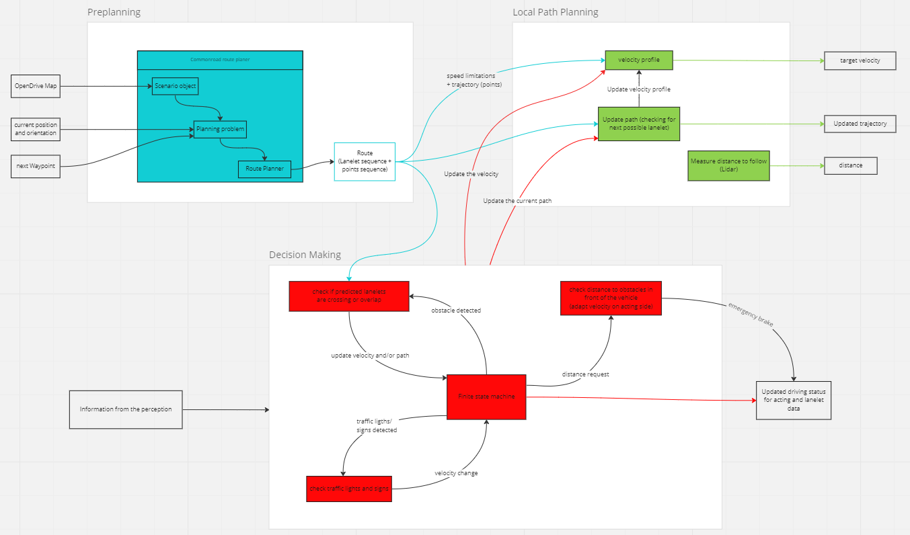

# Planning Implementation

**Summary:** 
The document gives a first impression of how the planning could/should work
and how the topics are edited
---

## Author

Simon Erlbacher, Niklas Vogel

## Date

29.11.2022

## Prerequisite

---
<!-- TOC -->
* [Planning Implementation Details](#coding-style-guidelines)
  * [Author](#author)
  * [Date](#date)
  * [Prerequisite](#prerequisite)
  * [Visualization](#visualization)
  * [Preplanning](#preplanning)
  * [Local Path Planning](#local-path-planning)
  * [Decision Making](#decision-making)
  * [Next steps](#next-steps)
* [Sources](#sources)
<!-- TOC -->

---
## **Visualization** 

---
## **Preplanning**
  
The Preplanning receives the next [target point](./basics.md#wie-sehen-die-daten-vom-leaderboard-fr-das-global-planning-aus) from the Carla Leaderboard. Also it reads the map data which is in [OpenDrive](https://www.asam.net/standards/detail/opendrive/) format. The [commonroad route planner (CRP)](https://gitlab.lrz.de/tum-cps/commonroad-route-planner/) from TUM can be used to calculate a Lanelet model (Note that almost all old PAF-Projects have adapted versions of the CRP). Internally the CRP converts the Map into a Scenario Object. When given a start and goal position and the current orientation of the vehicle a so called planning problem is created by the planer. The Orientation can be calculated on the Odometry and the GNUU data from the sensoring area. The Output (Solution of the planning problem) will be a route defined by a sequence of lanelets and a sequence of points (~ 10cm apart).

Lanelet Model Example :
[[Source]](https://github.com/ll7/psaf2/tree/main/Planning/global_planner)

Input: 
* Odometry data (sensoring)
* GNUU data (sensoring)
* Map
* Navigation Waypoints

Output:
* Route (Sequences of Lanelets and Points) (local path planning, decision making)

---

## **Local Path Planning**

Local Planner updates the current route, if Decision Making detects an obstacle. The planner then has to choose an alternative next Lanelet to avoid the obstacle. Therefore the obstacle position on the lanelet plan will be needed. 

### <u>_Velocity profile_</u>

The Local Path Planer receives the lanelets, points and the path to drive. The local planner creates a velocity profile on the calculated trajectory based on curvature, crossings and traffic lights. This will be calculated directly after the preplanning created a trajectory. The velocity value is published to the acting side, where the current speed and the braking distance is held and calculated. If the velocity is too high or too low, the Acting will realize and sends changes to adapt the speed of the vehicle.

Input:

* Trajectory points (preplanning)

Output:

* Max. Velocity (Acting)

### <u>_Update path_</u>

The update path module receives a command from the decision maker, that the current path is not possible to drive without collision. It uses the lanelet modell from the preplanner and chooses the next possible lanelet and accordingly updates the trajectory. It also tells the velocity profile to update because of the new trajectory.

Input:

* lanelet modell (preplanning)
* update command (decision making)
* information about blocked lanelets (decision making, perception)

Output:
* updated trajectory (acting, decision making)
* update command (velocity profile)

### <u>_Measure distance_</u>

This module measures the distance to obstacles, especially cars, with the Lidar Sensor. The current distance value is published to the acting side for keeping a safe distance (Adaptive Cruise Control).

Input:

* Lidar Sensor data (perception, sensoring)

Output:

* distance value (acting)

---
## **Decision Making**

Obstacle detection is based on the sensor data from the perception area. If an obstacle is being recognized, the decision making sends a message to the local path planning where the system then chooses another trajectory/lanelet.
With the Lanelets Model it is possible to give a prediction for other objects and the vehicle itself, by following the lanelet direction of an object.

The decision making can be implemented with a state machine. For every incoming perception there must be a state defined. The system needs to make good predictions to avoid collisions. The Perception data and the Lanelet modell are the main input for the system.

Input:

* Lanelet data (preplanning, local path planning)
* perception data (traffic lights situation, pedestrians,...)

Output:

* updated driving status (acting, local path planning)
* Lanelet data (acting)

---
## Next steps

* Implement Map Manager to convert data into a compatible type for route planning and to extract additional informations (Speed Limits, trafic signs, traffic lights)
* Implement a commonroad route planner (old projects and Gitlab TUM)
* Analyze Lanelet plan and be familiar with it (Which information can we additionally receive from the plan?)
* Enrich Lanelet Modell/Map with additional Informations (additional/parallel Lanes, Speed Limits, trafic signs, traffic lights)
* Choose the Decision Maker (Evaluate Markov Modell in combination with occupancy grid)
* Read Lidar Sensor data and calculate distances
* Publish available and needed data (data available in this stage) 
---
### Sources

https://github.com/ll7/paf21-2/tree/main/paf_ros/paf_planning

https://gitlab.lrz.de/tum-cps/commonroad-route-planner