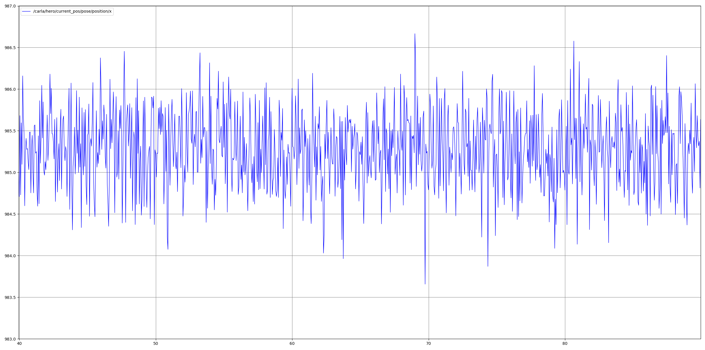
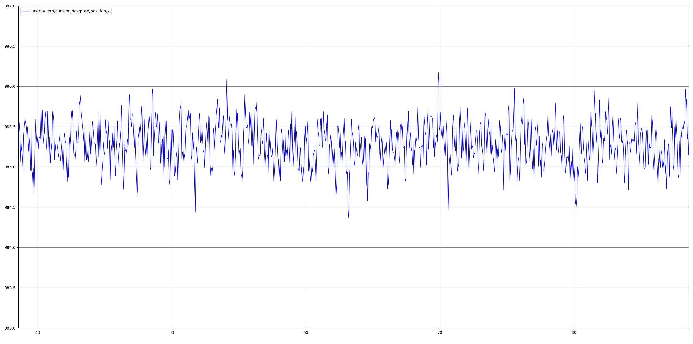
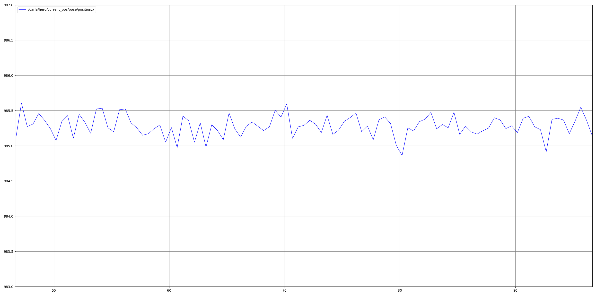
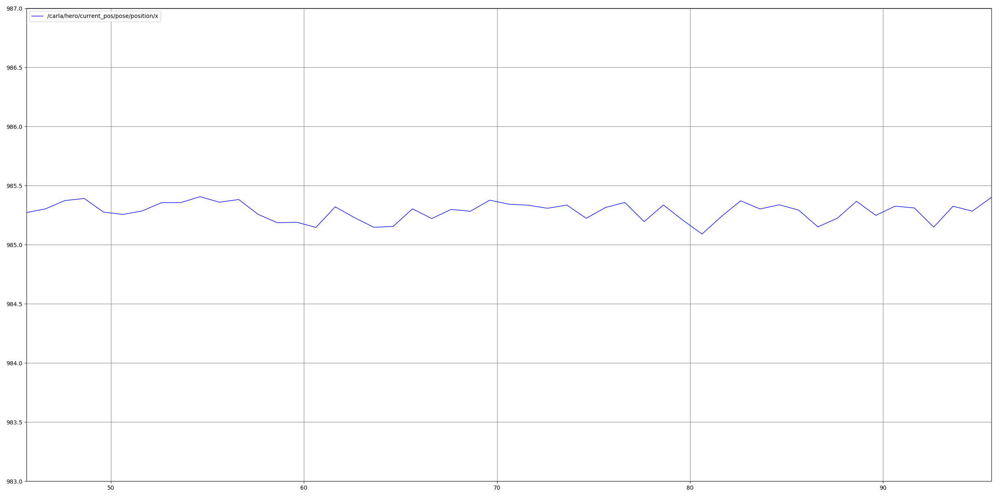

# GPS sensor

**Summary:** This page explains how the GPS sensor is handled including a short example on how to use it.

---

## Authors

Gabriel Schwald

### Date

07.01.2023

---
[TOC]

## Raw sensor data

The GPS sensor (GNSS) provides us with measurements for latitude, longitude and height.
While latitude and longitude are measured in degrees, altitude is measured in meters.

## Filters for the sensor data

As with all sensors provided by Carla, the GPS sensor output contains artificial noise.

Right now there are multiple types of filters implemented.

### Intuitive filter

The first way combines the two most intuitive methods of smoothing the input.
At first, multiple ($m$) inputs are summed up and divided to take an average.
Secondly, before updating the current position, the old position is saved.
The two positions are then added with a weight $w$, to adjust the responsiveness of the output signal.

The number of separate inputs taken into account for the average and the weight of old input can be seen as tweak-able 
parameters. 
The following graphs were taken while the car was stationary, the time on the bottom is therefore irrelevant.
Shown is the position translated to a local coordinate system, the transformation will be discussed in //TODO add ref.

Using $w = 0.5$ clearly reduces the magnitude of the noise, however such a small value reduces the responsiveness
of the output signal.

Using a large number of data points ($m = 10$) also improves the magnitude of the noise.
The main drawback here is the reduced frequency of the output signal, as the frequency of the output signal 
is $\frac{1}{m}$ that of the input signal.
This can be avoided through the use of a rolling average where for every output 
the last $m$ inputs are taken into account. 

Combining these two parameters can lead to further improve the result.

The output signals frequency has now been reduced to 1Hz compared to the original 20Hz frequency,
with the weight now being set to $w = 0.75$

Further improvements can be made by using a rolling average, where the last $m$ points are taken into account
for the average, however the frequency is not changed, as this average is calculated for every new point received.
This method is slightly more computationally intensive.

