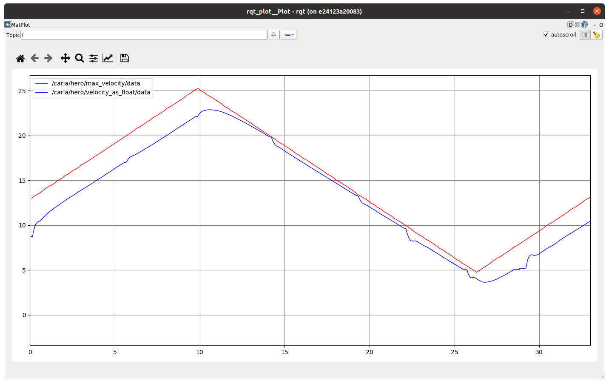

# How to test acting components

**Summary:** This page shows ways to verify that acting components work as expected

---

## Author

Julian Graf

## Date

09.01.2023

<!-- TOC -->
* [How to test acting components](#how-to-test-acting-components)
  * [Author](#author)
  * [Date](#date)
  * [velocity_controller](#velocitycontroller)
<!-- TOC -->

## velocity_controller

To test the velocity controller, set the parameter ```enabled``` in the acting launch-file true. Now the velocity_publisher_dummy will publish dummy target speeds. Use ```rqt_plot /carla/hero/velocity_as_float /carla/hero/max_velocity``` to visualize target and current speeds.


