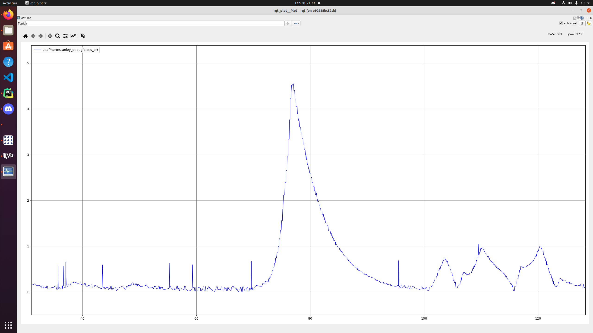
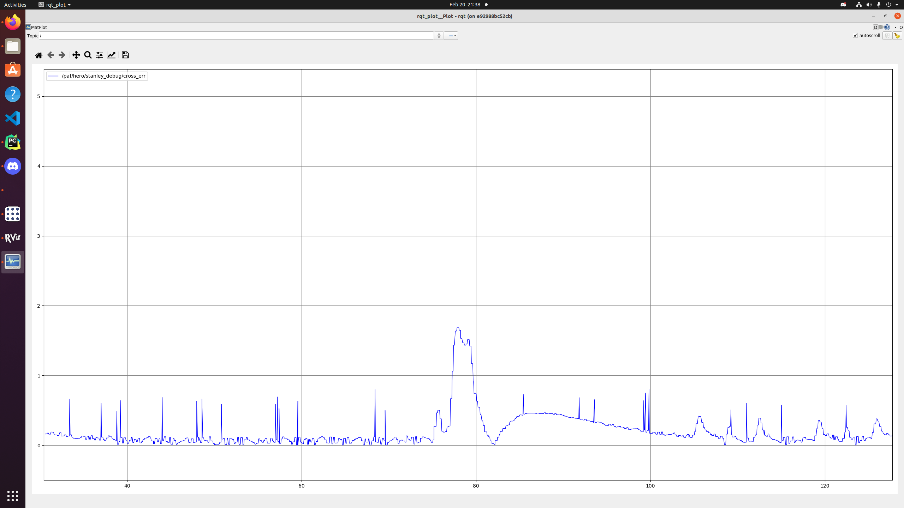
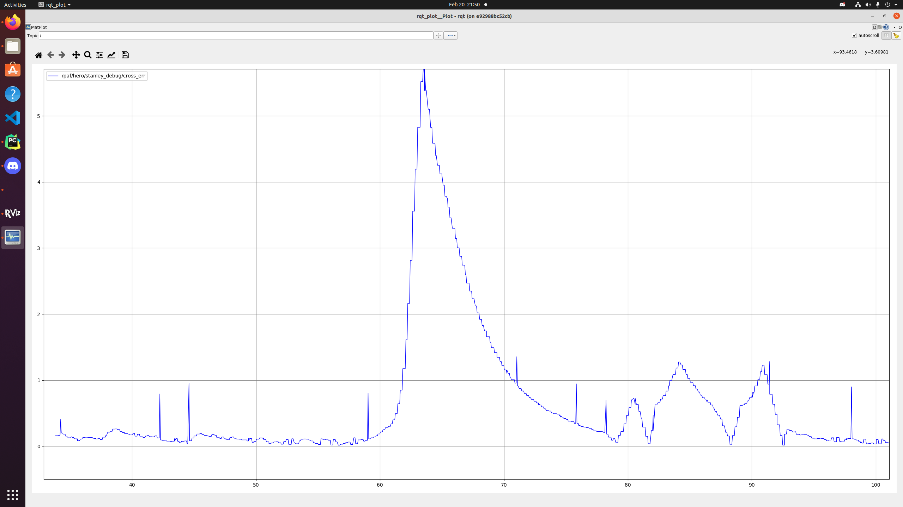
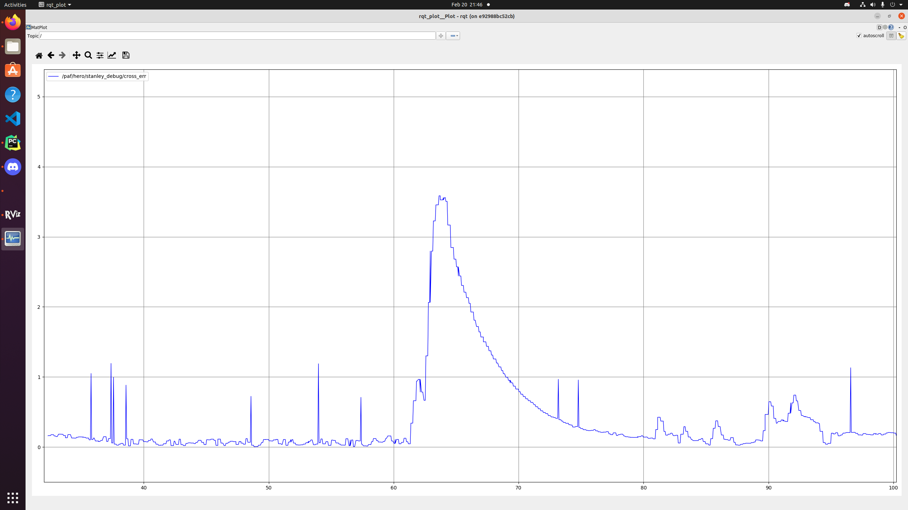

# Overview of the current status of the lateral controller

**Summary:** This page provides an overview of the current status of lateral controllers

---

## Author

Gabriel Schwald

## Date

20.02.2023

<!-- TOC -->
* [Overview of the current status of the lateral controller](#overview-of-the-current-status-of-the-lateral-controller)
  * [Author](#author)
  * [Date](#date)
  * [Lateral controller](#lateral-controller)
  * [Baseline](#baseline)
    * [Velocity](#velocity)
    * [Parameters](#parameters)
  * [Tuning](#tuning)
<!-- TOC -->

## Lateral controller

At the moment the control algorithm is chosen manually by editing Line 223 in vehicle_controller.py.
Accordingly, only one controller can be used per run, this will later be changed,
in order to use each controller in its most effective range.

The testing scenario consists of a manually created L-shaped trajectory, with a short slalom section at the end.
Testing with real trajectories will definitely help in improving the controllers,
but is not yet available at this time.

## Baseline

With a somewhat constant velocity of around 4.5 m/s the following distance to the trajectory can be observed with the
default parameters.

Pure Pursuit Baseline

Stanley Baseline

### Velocity

Increasing the velcoity by around 2 m/s to 6.25 m/s already has an observable effect on the error.

Pure Pursuit with increased velocity

Stanley with increased velocity

### Parameters

The following parameters may be considered for optimization:

Stanley:

* k_ce <--> cross-track error weight
* k_v <--> velocity weight

Pure-Pursuit:

* k_ld <--> look-ahead distance weight
* look_ahead_dist <--> minimum look-ahead distance (maybe remove altogether?)

The PID-Controller for the steering angle may also be tuned independently of the tuning of both controllers.

## Tuning

This document will be updated, whenever sizeable progress is made.
