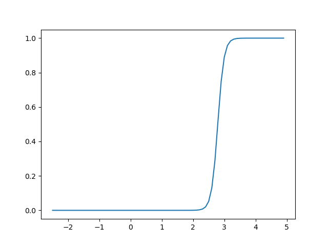

# Overview of the current status of the lateral controller

**Summary:** This page provides an overview of the current status of lateral controllers

---

## Author

Gabriel Schwald

## Date

20.02.2023

<!-- TOC -->
* [Overview of the current status of the lateral controller](#overview-of-the-current-status-of-the-lateral-controller)
  * [Author](#author)
  * [Date](#date)
  * [Lateral controller](#lateral-controller)
  * [Baseline](#baseline)
    * [Velocity](#velocity)
    * [Parameters](#parameters)
  * [Tuning](#tuning)
<!-- TOC -->

## Lateral controller

The following test were performed with only one controller active at all times

The testing scenario consists of a manually created L-shaped trajectory, with a short slalom section at the end.
Testing with real trajectories will definitely help in improving the controllers,
but wasn't available in time.

## Baseline

With a somewhat constant velocity of around 4.5 m/s the following distance to the trajectory can be observed with the
default parameters.

Pure Pursuit Baseline

Stanley Baseline

### Velocity

Increasing the velcoity by around 2 m/s to 6.25 m/s already has an observable effect on the error.

Pure Pursuit with increased velocity

Stanley with increased velocity

### Parameters

The following parameters may be considered for optimization:

Stanley:

* k_ce <--> cross-track error weight
* k_v <--> velocity weight

Pure-Pursuit:

* k_ld <--> look-ahead distance weight
* look_ahead_dist <--> minimum look-ahead distance (maybe remove altogether?)

The PID-Controller for the steering angle may also be tuned independently of the tuning of both controllers.

## Vehicle controller

In order to improve the score of the agent it was decided to use both controllers.

Instead of a binary switch where only one controller is active at all times, we use a sigmoid function for switching.
This sigmoid function outputs the percentage that should be used of stanley controller $ p_{stan} $.
The threshold velocity at which the switch between controllers happens can be set using
[STANLEY_CONTROLLER_MIN_V](../../code/acting/src/acting/vehicle_controller.py).
The actual steering angle $ \theta $ is therefore calculated using the following formula:
$$ \theta (t) = p_{stan}(t)*\theta_{stan}(t) + (1-p_{stan}(t)) \theta_{purep}(t) $$

The following graph shows the amount of stanley that is used with a threshold velocity of 2.78 m/s.
.

## Notes

Some final remarks on the state of the lateral controller

### Tuning

As mentioned in the introduction there wasn't sufficient time left to tune all the parameters outlined here.
The deviation from the trajectory may be decreased by tuning these parameters.

### Parking

In order to leave the parking spot at the beginning of each scenario the pure pursuit controller
is currently tuned for very low velocities. The velocity of the vehicle is also limited to a certain speed for
x seconds after the first movement. X can be adjusted using
[PARKING_DUR](../../code/acting/src/acting/acting_velocity_publisher.py).
