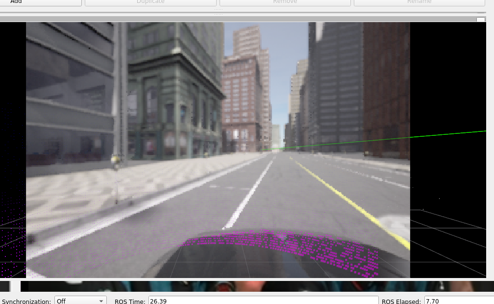

# Main frame publisher

**Summary:** This page informs about the main frame publisher

---

## Author

Julian Graf

## Date

29.03.2023

---

<!-- TOC -->
* [Main frame publisher](#main-frame-publisher)
  * [Author](#author)
  * [Date](#date)
  * [Main frame publisher](#main-frame-publisher-1)
  * [How to use](#how-to-use)
  * [Known issues](#known-issues)
<!-- TOC -->

## Main frame publisher

The main frame publisher is needed to visualize the path created by the planning in rviz.
The main frame publisher handles the translation between the static global frame and the moving hero frame.
The hero frame moves and rotates as the ego vehicle does. The path published by the planning (or the dummy at the moment) uses the global frame, while rviz uses the hero frame.

## How to use

To visualize objects in rviz make sure they are published with the ```frame_id = "global"```. In rviz under ```Displays > Global Options > Fixed Frame``` choose ```hero```.

## Known issues

Due to time restrictions the main frame publisher does not work perfectly.
There are issues if the vehicle drives upwards or downwards.
In this case the path will start to rise above the street (see picture) or start to move bellow the street.
You can counteract this by changing the z offset of the path in rviz.


