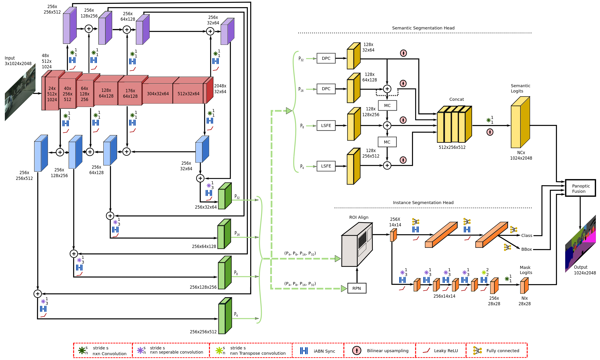

# EfficientPS

**Summary:** This document gives a short overview about EfficientPS and its training process.

---

## Author

Marco Riedenauer

## Date

28.03.2023

<!-- TOC -->
* [EfficientPS](#efficientps)
  * [Author](#author)
  * [Date](#date)
  * [Model Overview](#model-overview)
  * [Training](#training)
    * [Labels](#labels)
    * [Training parameters](#training-parameters)
    * [Train](#train)
<!-- TOC -->

## Model Overview

EfficientPS is a neural network designed for panoptic segmentation
(see [Panoptic Segmentation](../03_research/02_perception/03_first_implementation_plan.md#panoptic-segmentation)).
The model itself consists of 4 parts as can be seen in the following figure. The displayed shapes are incorrect in our
case, since we used half the image size.


[Source](https://arxiv.org/pdf/2004.02307.pdf)

* Feature Extraction:
  This is the first part of the model on which all following parts depend on. In this part, all important features are
  extracted from the input image.
* Semantic Segmentation Head: As the name implies, this part of the model computes a semantic segmentation on the
  extracted features.
* Instance Segmentation Head: This part computes the instance segmentation on things on the extracted features.
* Panoptic Fusion: As the last part of the model, this component is responsible for combining the information gathered
  by the semantic segmentation and the instance segmentation heads. The output of this component and thereby the model
  is an image where stuff is semantic segmented and things are instance segmented.

## Training

### Labels

As we trained the net with the output of the instance segmentation camera of CARLA 9.14, we used the same labels as
CARLA. The definition of labels can be found in
[labels.py](../../code/perception/src/panoptic_segmentation/preparation/labels.py).

At the moment we are using only important labels for training. Unnecessary labels like e.g. sky are ignored during
training and can thereby not be detected. To remove/add a label to the training, set the entry "ignoreInEval" of the
corresponding label to True/False.

### Training parameters

All adaptable training parameters can be found and changed in
[config.yaml](../../code/perception/src/panoptic_segmentation/config.yaml).

The most important configs are:

* MODEL/ROI_HEADS/NUM_CLASSES: Number of instance classes
* DATASET_PATH: Path to dataset root
* TRAIN_JSON: Relative path from DATASET_PATH to train json file
* VALID_JSON: Relative path from DATASET_PATH to validation json file
* PRED_DIR: Directory to save predictions in
* PRED_JSON: Name of prediction json file
* CHECKPOINT_PATH: Path of already trained models you want to train furthermore
* BATCH_SIZE: Number of images to be loaded during on training step
* NUM_CLASSES: Number of all classes

### Train

To start the training, just execute the following command in b5 shell:

```shell
python3 perception/src/panoptic_segmentation/train_net.py
```
