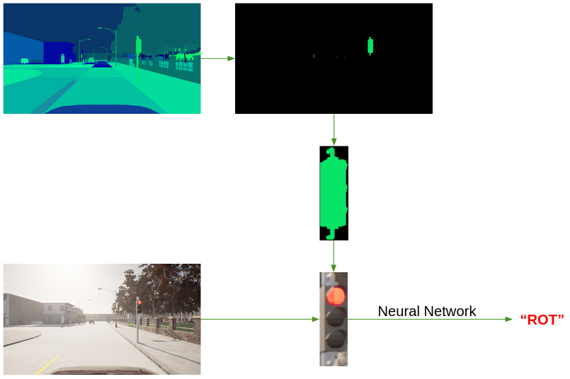

# Traffic Light Detection

**Summary:** This document gives a short overview about the traffic light detection module.

---

## Author

Marco Riedenauer

## Date

28.03.2023

<!-- TOC -->
* [Dataset structure](#dataset-structure)
  * [Author](#author)
  * [Date](#date)
  * [TLDNode](#tldnode)
<!-- TOC -->

## TLDNode

The TLDNode is responsible for receiving segmented images from EfficientPS or an instance segmentation camera, snipping
the detected traffic lights out of the image and classify them.

The first step is to mask out all pixels from the segmented image, which aren't classified as traffic light. In the
upper half and the segments 2/4 to 3/4 from left to right of the image, the biggest traffic light is searched and
snipped out of the image.
The same area is snipped out of the RGB image to receive the traffic light as RGB image. This traffic light is fed in
our [model](../../code/perception/src/traffic_light_detection/src/traffic_light_detection/traffic_light_inference.py)
for traffic light classification.
