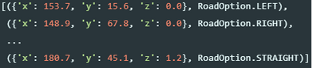
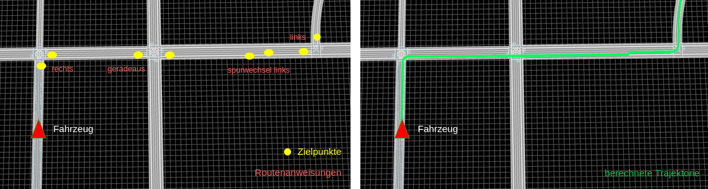
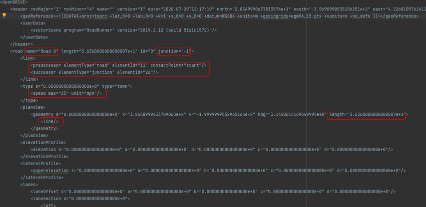
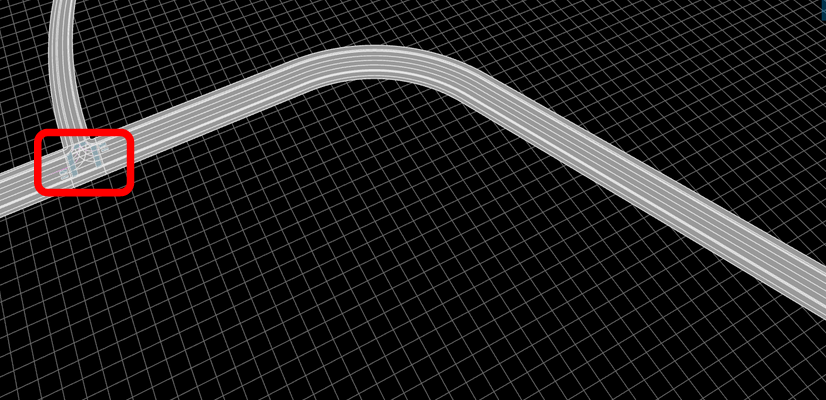
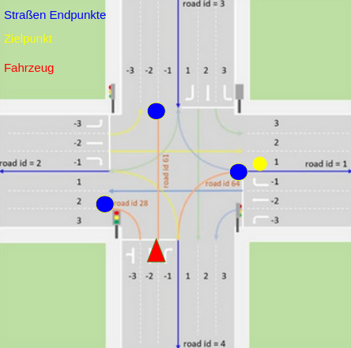
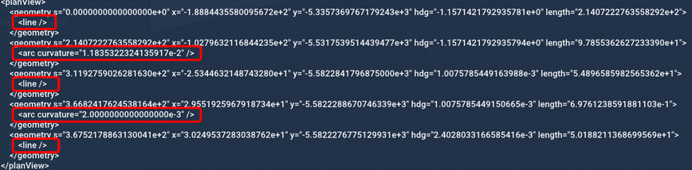
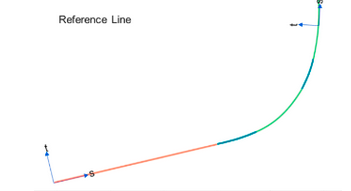

# Preplanning

**Summary:** Preplanner holds the logic to create a trajectory out of an OpenDrive Map with the belonging road options

---

## Author

Simon Erlbacher, Niklas Vogel

## Date

29.03.2023

## Prerequisite

---
<!-- TOC -->
* [Preplanning](#preplanning)
  * [Author](#author)
  * [Date](#date)
  * [Prerequisite](#prerequisite)
  * [Getting started](#getting-started)
  * [Road option concept](#road-option-concept)
  * [Road information](#road-information)
  * [Junction](#junction)
  * [Road interpolation](#road-interpolation)
  * [How to use the implementation](#how-to-use-the-implementation)
    * [Sources](#sources)
<!-- TOC -->

---

## Getting started

Preplanning scripts are all integrated in this project and the used libraries are part of the docker file.
No extra installation needed.

---

## Road option concept

The leaderboard provides target points and instructions. Every target point contains an appropriate instruction.

We need to cover the following instructions for intersections:

* Turn left: 1
* Turn right: 2
* Straight: 3

The number shows which direction we need to cross an intersection.

We need to cover the following instructions for lane changes:

* No change: 4
* Change left: 5
* Change right: 6

We also get the information when we need to change a lane. For example before we reach an intersection.

This concept is used to calculate the trajectory. The following picture shows an overview of the concept, with a
clipping of town 12. It visualizes the agent (red triangle) and the first target points (yellow points) we received
from the leaderboard. It also shows the final trajectory on the right side. The picture covers a "turn right" and
a lane "change left".

---

## Road information

Important information we get from the xodr file.

* road geometry
* speed limit
* intersections
* traffic signs (not used in this project)
* successor and predecessor information about roads
* lane information (lane for driving?)
* lane width

The listed information from the OpenDrive map is used to calculate the trajectory and to give further information
to other components. The traffic signs information could **not** be used, because the information about the signs
only holds id values which have to be solved with the carla API. Also the name of the traffic signs is not consistent.
That is why we would need to get the information for every traffic sign id from carla. This would crash with the
leaderboard requirements. We are **not** allowed to use ground truth information from the game engine.

The picture shows the clipping of Road 0 from the leaderboard town 12.

The picture should give a short overview, where to find most of the information mentioned in the "road information"
section. The geometry part of the clipping indicates the form of the current road 0. In this case the road can
be interpolated with a line of the indicated length.
The junction information holds the value -1. This indicates, that the current road 0 is not part of a junction.
If the road would be part of a junction, there would be a id value greater than -1. This id references a junction.

---

## Junction

A junction manages colliding roads. Junctions only exist when roads intersect.

The picture above shows an intersection of roads. All possible ways through this intersection have to be covered.
The picture shows a clipping of town 12.

To view a xodr file we used the following [viewer](https://odrviewer.io/). Very helpful tool to get a better
understanding of an underlaying town and to debug the trajectory.

The picture above shows an intersection. The agent is visualized with the red triangle and wants to drive through
the intersection. He has three options, which are shown with the orange lines. The yellow point shows a target point
from the leaderboard. We want to reach this point.
We would need to choose the road 64 in the picture. For the correct choice we first calculated the endpoints for
all possible orange roads. Endpoints are marked with blue dots. In the second step we calculate the distance between
the blue endpoints and the yellow target point. The blue endpoint with the smallest distance indicated the road to
follow to cross the intersection.

---

## Road interpolation

Every road has a geometry information. This information is important to interpolate the road correctly.

The picture shows the clipping of a road with a curve. The road contains "line" segments and "arc curvature" segments.
We have to interpolate this segments in the provided order to reconstruct the reference line of a road.

The picture above shows the reference line with its different segments.

The calculation is done in the `help_functions.py`. We differ between line and arc segments.
Therefor we have two functions `linear_interpolation()`and `circular_interpolation()`, which are combined in the
function `interpolation()`.

Because we only could interpolate the reference line with this information, we also need to use the width value to
move the trajectorie in the middle of the road we want to drive. We need to filter the with values of the current road
and calculate the new trajectorie with the width distance from the reference line.
This is done in the `preplanning_trajectory.py` with the function `update_points()`.

---

## How to use the implementation

You have to call the functions in the present order.

`odc = OpenDriveConverter(roads, road_ids, junctions, junctions_ids)`

First you need to create an object of the class and provide 4 variables. The roads variable contains all possible road
references in a list. The road_ids is also a list containing the corresponding road id values. The same concept for
the junctions.

`odc.convert_roads()`

Convert the road_ids list in a required form. The road id value is also the list index.

`odc.convert_junctions()`

Convert the junction_ids list in a required form. The junction id value is also the list index.

`odc.filter_geometry()`

Filter the geometry data for every road. This is needed to interpolate the road with its different road segments.

`odc.initial_road_trajectory()`

This function calculates the starting road where the agent is located and also the trajectory for the first road.
The first road is handled extra, because we also need to calculate the side of the road, where the agent is located.
Also the trajectory for this road most of the time is not needed for the whole road. For example the agent can
be located in the middle of the road.

`odc.target_road_trajectory()`

This function is called for every new received road option and target point. It interpolated the current road, based
on the road options and updates the trajectory internally.

`odc.remove_outliner()`

This functions iterates over all calculated trajectory points and searches for outliers. If the distance of
two following points is to small or to big, the following point is deleted. This makes the trajectory clean and smooth.

---

### Sources

<https://www.asam.net/index.php?eID=dumpFile&t=f&f=4422&token=e590561f3c39aa2260e5442e29e93f6693d1cccd#top-016f925e-bfe2-481d-b603-da4524d7491f>
