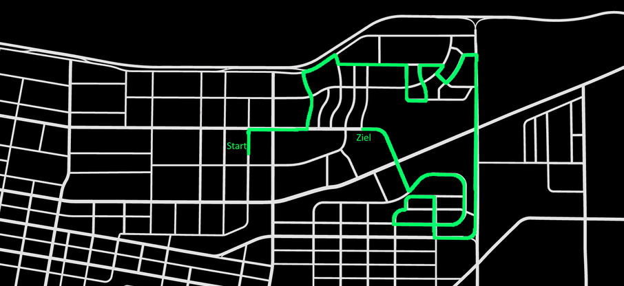
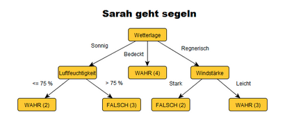

# Planning Wiki

---

## Structure

Planning wiki contains different parts:

- Preplanning
- Global plan
- Decision making

---

## Overview

### [Preplanning](./Preplanning.md)

Preplanning is very close to the global plan. The challenge of the preplanning focuses on creating a trajectory out of
an OpenDrive map (ASAM OpenDrive). As input it receives an xodr file (OpenDrive format) and the target points
from the leaderboard with the belonging actions. For example action number 3 means, drive through the intersection.

### [Global plan](./Global_plan.md)

The name global plan focuses to prepare the data for the preplanning component and to publish the output from the
preplanner to the other components of this project (acting, decision making,...). Also it coordinates the leaderboard
process. If we receive a new town and new road options, the data is prepared and the preplanner is started.

### [Decision making](../../code/planning/behavior_agent/readme.md)

The decision making collects most of the available information of the other components and makes decisions based on
the information. All possible traffic scenarios are covered in this component. The decision making uses a so called
decision tree, which is easy to adapt and to expand.

