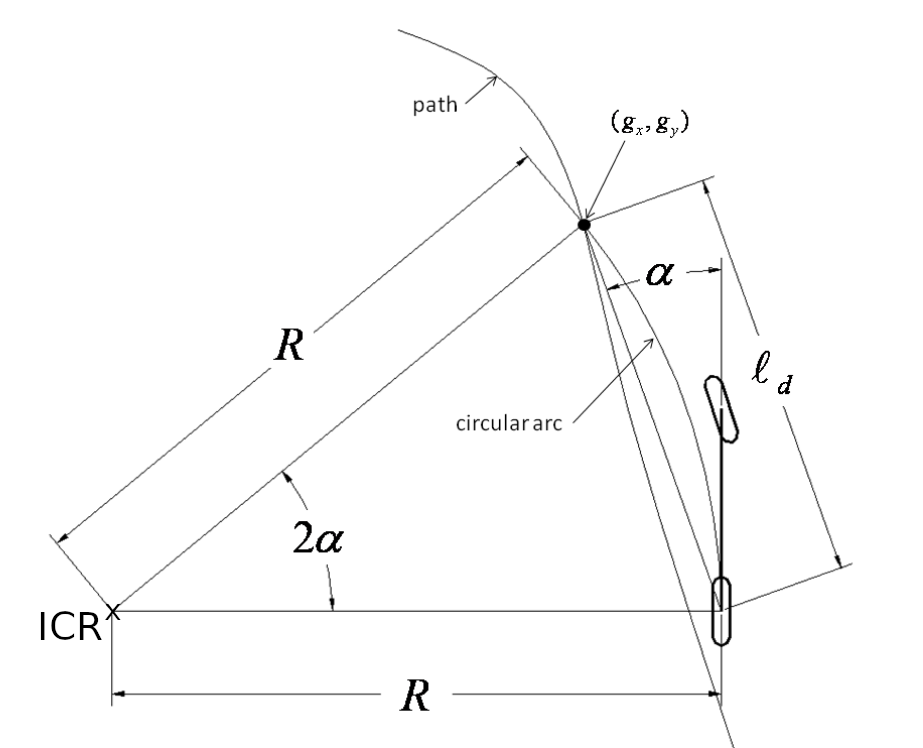

# Grundrechereche Acting

**Summary:** This document focuses on the most basic of the three branches in this project: acting. After reading this page, every participant is therfore able to wheigh the advandteges of every proposed solution.

---

## Who to blame?

### Author

Gabriel Schwald

### Date

16.11.2022

---

## Context

The job of this domain is to translate a preplanned trajecotry into actual steering controls for the vehicle.
All the planning is therefore done in other subsystems of the vehicle.

---

## Longitudinal Control

---

## Lateral Control

Once a trajectory is established in planing, the vehicle needs to follow this trajectory to the best of it's ability. A few algortihms exist for this purpose, with variing degrees of complexity. With longitudinal control already taken care of, we only need to worry about steering angle and our position relative to the trajectory.

### Pure Pursuit Controller (dangling carrot controller)

This is the simplest way to steer a vehicle, however this doesn't mean that it can't be used in practice.
There are two main simplifications made.

1. Use the bicycle model (combine front/rear wheels -> one wheel per axle)
2. Elevation isn't considered (-> both axles are at the same height)

The steering angle $\delta$ is defined as the angle of the front wheel to a line drawn between the center of both axles.
This angle $\delta$ can also be defined as $tan(\delta) = L/R$ with $L$ as the wheelbase and $R$ the radius from the reference point (rear axle) to the Instantaneous Center of Rotation (ICR). Due to the bicycle model we can calculate $R = \frac{L}{tan(\delta)}$.

*source: [2]*

We now try to aim the circular arc to intersect with a point on our trajectory. This target point is always a defined distance (look ahead distance $l_d$) away from our reference point (dangling carrot). This leads to the following relation:

*source: [2]*

$\frac{l_d}{sin(\alpha)}= 2R$, where $\alpha$ is the current heading error. Combining the two equations leads to our desired steering angle.

$$
\delta(t) = arctan(2L * \frac{sin(\alpha)}{l_d})
$$

This method can be tuned to work perfect for a certain speed, however we would like it to work in all speed regimes.
We therefore calculate $l_d$ based on our current speed $v(t)$ and a tuneable constant $K_d$ (, $l_d(t) = v(t) * K_d$).
This leads to the final equation for our steering angle.

$$
\delta(t) = arctan(2L* \frac{sin(\alpha)}{K_d * v})
$$

### Stanley Controller

The Stanley controller, named after an autonomous offroad race car, takes the front axle as a reference, while still using the bicycle model.
In addition to looking at the heading error $\psi$, close to what pure pursuit does, stanley also looks at the cross track error $e_e$.
The cross track error $e_e$ is defined as the distance between the reference point and the closest point on our trajectory.

*source: [2]*

The first part of our sterring angle trys to correct for this error $arctan(\frac{k_e*e_e}{k_v*v})$ while the second part just corrects for our heading error $\psi$.

This leads to the following equation for our sterring angle.

$$
\delta(t) = \psi(t) + arctan(\frac{k_e*e_e(t)}{k_v*v(t)})
$$

With $k_e$ and $k_v$ being tuneable parameters for cross tracking error and speed respectively.

## Sources

1. [Algorithm overview](https://www.ri.cmu.edu/pub_files/2009/2/Automatic_Steering_Methods_for_Autonomous_Automobile_Path_Tracking.pdf)
2. [Understading geometric path tracking](https://medium.com/roboquest/understanding-geometric-path-tracking-algorithms-stanley-controller-25da17bcc219)
3. G. M. Hoffmann, C. J. Tomlin, M. Montemerlo and S. Thrun, "Autonomous Automobile Trajectory Tracking for Off-Road Driving: Controller Design, Experimental Validation and Racing," 2007 American Control Conference, 2007, pp. 2296-2301, doi: 10.1109/ACC.2007.4282788.
4. [Bosch: sense, think, act](https://www.bosch-mobility-solutions.com/en/mobility-topics/automated-driving-sense-think-act/)

---

## Interfaces

A list of preliminary in-/outputs:

**Inputs:**

1. Trajectory
2. Current Positon
3. Current Heading
4. (Distance to obstacles for turning?)
5. (Road conditions?)

**Outputs:**

1. Acceleration
2. Breaking
3. Reverse
4. Steering angle
