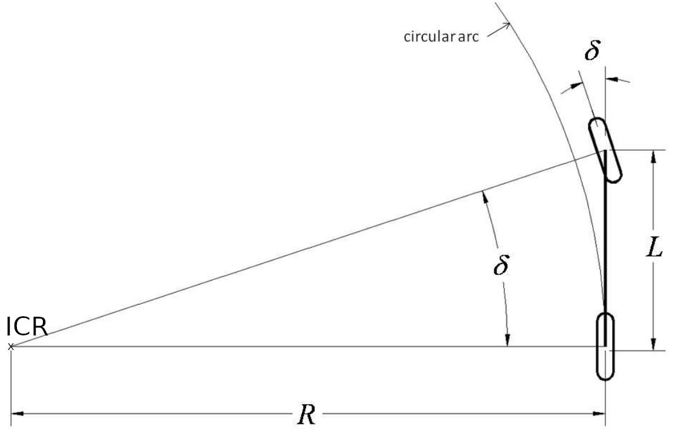
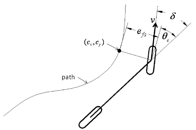

# Basic research acting

**Summary:** On this page you can find the results of the basic research on acting.

---

### Authors

Gabriel Schwald, Julian Graf

### Date

14.11.2022

---
[[TOC]]

## Objective

The job of this domain is to translate a preplanned trajectory into actual steering controls for the vehicle.

- safety:
  - never exceeding vehicle limits
  - never exceeding speed limits
  - never leaf path
- driving comfort?

## Solutions from old PAF projects

### [Paf 20/1](https://github.com/ll7/psaf2/wiki/Path-Tracking-Algorithmen)

- modified [carla_ackermann_control](https://carla.readthedocs.io/projects/ros-bridge/en/latest/carla_ackermann_control/)
- input: [twist-msgs](http://docs.ros.org/en/noetic/api/geometry_msgs/html/msg/Twist.html) (for velocity)
- velocity control: PID
- lateral control: PD (heading error)

### [Paf 21/1](https://github.com/ll7/paf21-1/wiki/Vehicle-Controller)

- input: waypoints
- curve detection: returns distance to next curve
- calculation of max curve speed as sqrt(friction_coefficient  *gravity_accel* radius)
- in Curve: naive Controller
- on straights: stanley controller
- interface to rosbridge

### [Paf 20/2](https://github.com/ll7/psaf2) and [Paf 21/2](https://github.com/ll7/paf21-2/tree/main/paf_ros/paf_actor#readme)

- input: odometry(position and velocity with uncertainty), local path
- lateral: Stanley Controller
- speed controller: pid
- ACC: (speed, distance) -> PID
- Unstuck-Routine (drive backwards)
- Emergency Modus: fastest possible braking ([Tests](https://github.com/ll7/paf21-2/blob/main/docs/paf_actor/backwards/braking.md) -> handbrake with throttle, 30° steering and reverse)

## Lateral control

Model: [Ackermann steering geometry](https://en.wikipedia.org/wiki/Ackermann_steering_geometry)

### Pure Pursuit

This is the simplest way to steer a vehicle, however this doesn't mean that it can't be used in practice. There are two main simplifications made.

1. Use the bicycle model (combine front/rear wheels -> one wheel per axle)
2. Elevation isn't considered (-> both axles are at the same height)

The steering angle $\delta$ is defined as the angle of the front wheel to a line drawn between the center of both axles. This angle $\delta$ can also be defined as $tan(\delta) = L/R$ with $L$ as the wheelbase and $R$ the radius from the reference point (rear axle) to the Instantaneous Center of Rotation (ICR). Due to the bicycle model we can calculate $R = \frac{L}{tan(\delta)}$.

*source: [2]*

We now try to aim the circular arc to intersect with a point on our trajectory. This target point is always a defined distance (look ahead distance $l_d$) away from our reference point (dangling carrot). This leads to the following relation:

*source: [2]*

$\frac{l_d}{sin(\alpha)}= 2R$, where $\alpha$ is the current heading error. Combining the two equations leads to our desired steering angle.

$$
\delta(t) = arctan(2L * \frac{sin(\alpha)}{l_d})
$$

This method can be tuned to work perfect for a certain speed, however we would like it to work in all speed regimes. We therefore calculate $l_d$ based on our current speed $v(t)$ and a tunable constant $K_d$ (, $l_d(t) = v(t) * K_d$). This leads to the final equation for our steering angle.

$$
\delta(t) = arctan(2L* \frac{sin(\alpha)}{K_d * v})
$$

- simple controller
- ignores dynamic forces
- assumes no-slip condition
- possible improvement: vary the look-ahead distance based on vehicle velocity
- not really suited for straights

### Stanley

The Stanley controller, named after an autonomous offroad race car, takes the front axle as a reference, while still using the bicycle model. In addition to looking at the heading error $\psi$, close to what pure pursuit does, stanley also looks at the cross track error $e_e$. The cross track error $e_e$ is defined as the distance between the reference point and the closest point on our trajectory.

*source: [2]*

The first part of our steering angle tries to correct for this error $arctan(\frac{k_e*e_e}{k_v*v})$ while the second part just corrects for our heading error $\psi$.

This leads to the following equation for our steering angle.

$$
\delta(t) = \psi(t) + arctan(\frac{k_e*e_e(t)}{k_v*v(t)})
$$

With $k_e$ and $k_v$ being tunable parameters for cross tracking error and speed respectively.

### [MPC](https://en.wikipedia.org/wiki/Model_predictive_control) (Model Predictive Control) / receding horizon control

The basic idea of MPC is to model the future behavior of the vehicle and compute an optimal control input that, minimizes an a priori defined cost functional.

*source: [5]*

- cost function can be designed to account for driving comfort

### [SMC](https://en.wikipedia.org/wiki/Sliding_mode_control) (sliding mode control)

SMC systems are designed to drive the system states onto a particular surface in the state space, named sliding surface. Once the sliding surface is reached, sliding mode control keeps the states on the close neighborhood of the sliding surface.
Real implementations of sliding mode control approximate theoretical behavior with a high-frequency and generally non-deterministic switching control signal that causes the system to chatter.

*source: [9]*

- simple
- robust
- stabile
- disadvantage: chattering

Sources:

1. [Algorithm overview](https://www.ri.cmu.edu/pub_files/2009/2/Automatic_Steering_Methods_for_Autonomous_Automobile_Path_Tracking.pdf)
2. [Understanding geometric path tracking](https://medium.com/roboquest/understanding-geometric-path-tracking-algorithms-stanley-controller-25da17bcc219)
3. G. M. Hoffmann, C. J. Tomlin, M. Montemerlo and S. Thrun, "Autonomous Automobile Trajectory Tracking for Off-Road Driving: Controller Design, Experimental Validation and Racing," 2007 American Control Conference, 2007, pp. 2296-2301, doi: 10.1109/ACC.2007.4282788.
4. [Bosch: sense, think, act](https://www.bosch-mobility-solutions.com/en/mobility-topics/automated-driving-sense-think-act/)
5. [Three Methods of Vehicle Lateral Control: Pure Pursuit, Stanley and MPC](<https://dingyan89.medium.com/three-methods-of-vehicle-lateral-control-pure-pursuit-stanley-and-mpc-db8cc1d32081>)
6. [Comparison of lateral controllers for autonomous vehicle: experimental results](<https://hal.archives-ouvertes.fr/hal-02459398/document>)
7. <https://de.mathworks.com/help/nav/ug/pure-pursuit-controller.html>
8. <https://thomasfermi.github.io/Algorithms-for-Automated-Driving/Control/PurePursuit.html>
9. [Chattering Problem in Sliding Mode Control Systems](<https://ieeexplore.ieee.org/document/1644542>)
10. [A Tutorial On Autonomous Vehicle Steering Controller Design, Simulation and Implementation](<https://arxiv.org/pdf/1803.03758.pdf>)
11. [A path-tracking algorithm using predictive Stanley lateral controller](<https://www.researchgate.net/publication/347286170_A_path-tracking_algorithm_using_predictive_Stanley_lateral_controller>)
12. [Model Predictive Control](https://www.ist.uni-stuttgart.de/research/group-of-frank-allgoewer/model-predictive-control/)
13. Decarlo, R.A., & Żak, S.H. (2008). A Quick Introduction to Sliding Mode Control and Its Applications 1.

## Velocity control

PID: already implemented in [ROS](http://wiki.ros.org/pid)
(and [CARLA](https://carla.readthedocs.io/projects/ros-bridge/en/latest/carla_manual_control/)) with autotune feature

Sources:

- <https://www.ri.cmu.edu/pub_files/pub3/coulter_r_craig_1996_1/coulter_r_craig_1996_1.pdf>

## Interface

**subscribes** to:

- current position
  ([nav_msgs/Odometry Message](http://docs.ros.org/en/noetic/api/nav_msgs/html/msg/Odometry.html)) from Perception?
- path ([nav_msgs/Path Message](https://docs.ros.org/en/api/nav_msgs/html/msg/Path.html)) or target point ([geometry_msgs/Pose.msg](https://docs.ros.org/en/api/geometry_msgs/html/msg/Pose.html))
- (maximal) velocity to drive
- (distance and speed of vehicle to follow)
- (commands for special routines)
- (Distance to obstacles for turning/min turning radius)
- (Road conditions)

**publishes**:
[CarlaEgoVehicleControl.msg](https://carla.readthedocs.io/projects/ros-bridge/en/latest/ros_msgs/#carlaegovehiclecontrolmsg) or [ackermann_msgs/AckermannDrive.msg](https://docs.ros.org/en/api/ackermann_msgs/html/msg/AckermannDrive.html)

## Limits

In the [CarlaEgoVehicleInfo.msg](https://carla.readthedocs.io/projects/ros-bridge/en/latest/ros_msgs/#carlaegovehicleinfomsg) we get a [CarlaEgoVehicleInfoWheel.msg](https://carla.readthedocs.io/projects/ros-bridge/en/latest/ros_msgs/#carlaegovehicleinfowheelmsg) which provides us with

- tire_friction (a scalar value that indicates the friction of the wheel)
- max_steer_angle (the maximum angle in degrees that the wheel can steer)
- max_brake_torque (the maximum brake torque in Nm)
- max_handbrake_torque (the maximum handbrake torque in Nm)

The max curve speed can be calculated as sqrt(**friction_coefficient**  *gravity_accel* curve_radius).

CARLA has [friction triggers](https://carla.readthedocs.io/en/0.9.7/how_to_add_friction_triggers/) that can change the tire friction dynamically. CARLA has [weather presets](https://carla.readthedocs.io/en/stable/carla_settings/) but weather can be customized. Also [Road surfaces](https://carla.readthedocs.io/en/latest/tuto_M_custom_road_painter/) can be customized in CARLA.

## Visualization

For debugging purposes the vehicles path can be visualized using [carlaviz](https://carla.readthedocs.io/en/latest/plugins_carlaviz/) and [CarlaPainter](https://github.com/mjxu96/carlaviz/blob/master/examples/carla_painter.py).

## Additional functionality (open for discussion)

- ACC (Adaptive Cruise Control): reduces speed to keep set distance to vehicle in front (see also [cruise control technology review](https://www.sciencedirect.com/science/article/pii/S004579069700013X), [a comprehensive review of the development of adaptive cruise control systems](https://www.researchgate.net/publication/245309633_A_comprehensive_review_of_the_development_of_adaptive_cruise_control_systems), [towards an understanding of adaptive cruise control](https://www.sciencedirect.com/science/article/pii/S0968090X0000022X), [Encyclopedia of Systems and Control](https://dokumen.pub/encyclopedia-of-systems-and-control-2nd-ed-2021-3030441830-9783030441838.html))
- emergency braking: stops the car as fast as possible
- emergency braking assistant: uses Lidar as proximity sensor and breaks if it would come to a collision without breaking
- parallel parking: executes [fixed parking sequence](https://ieeexplore.ieee.org/stamp/stamp.jsp?tp=&arnumber=5705869) to parallel park vehicle in given parking space
- U-Turn: performs u-turn
- Driving backwards: might a need different controller configuration
- Unstuck routine: performs fixed routine (e.g. driving backwards) if the car hasn't moved in a while
