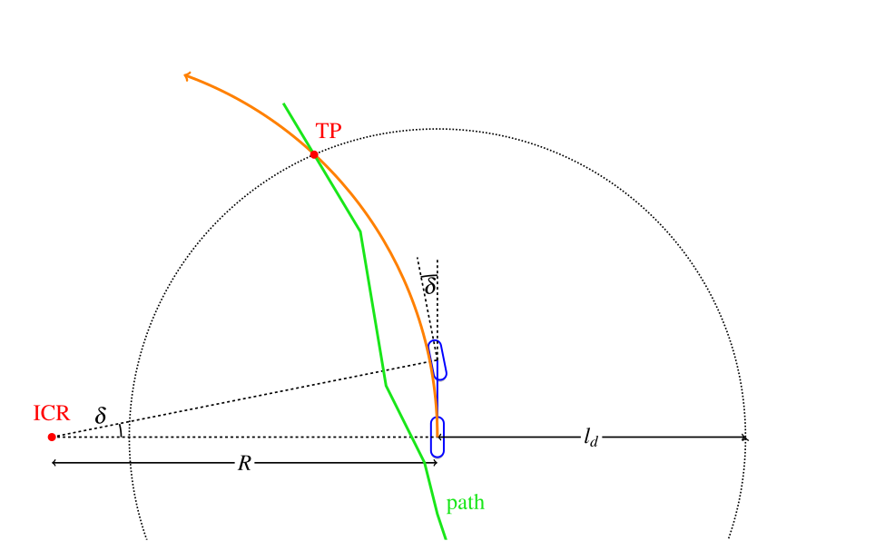
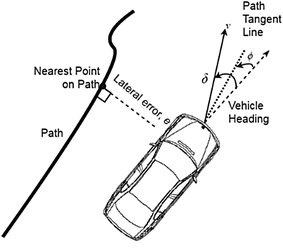
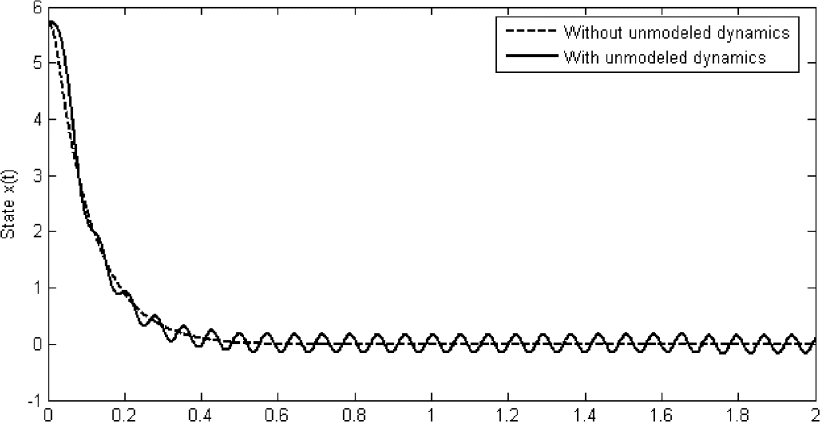

# Basic research acting

**Summary:** On this page you can find the results of the basic research on Acting.

---
### Author

Julian Graf

### Date

13.11.2022

---
[[TOC]] 

# Objective
- converting planned path into sensible vehicle control inputs
- safety:
  - never exceeding vehicle limits
  - never exceeding speed limits
  - never leaf path
- driving comfort?

# Solutions from old PAF projects

## [Paf 20/1](https://github.com/ll7/psaf2/wiki/Path-Tracking-Algorithmen)
- modified [carla_ackermann_control](https://carla.readthedocs.io/projects/ros-bridge/en/latest/carla_ackermann_control/)
- input: [twist-msgs](http://docs.ros.org/en/noetic/api/geometry_msgs/html/msg/Twist.html) (for velocity)
- velocity control: PID
- lateral control: PD (heading error)

## [Paf 21/1](https://github.com/ll7/paf21-1/wiki/Vehicle-Controller)
- input: waypoints
- curve detection: returns distance to next curve
- calculation of max curve speed as sqrt(friction_coefficient  * gravity_accel * radius)
- in Curve: naive Controller
- on straights: stanley controller
- interface to rosbridge

## [Paf 20/2](https://github.com/ll7/psaf2) and [Paf 21/2](https://github.com/ll7/paf21-2/tree/main/paf_ros/paf_actor#readme)
- input: odometry(position and velocity with uncertainty), local path
- lateral: Stanley Controller
- speed controller: pid
- ACC: (speed, distance) -> PID
- Unstuck-Routine (drive backwards)
- Emergency Modus: fastest possible braking 
  ([Tests](https://github.com/ll7/paf21-2/blob/main/docs/paf_actor/backwards/braking.md)
  -> handbrake with throttle, 30° steering and reverse)

# Lateral control
Model: [Ackermann steering geometry](https://en.wikipedia.org/wiki/Ackermann_steering_geometry)

## Pure Pursuit

- simple controller
- ignores dynamic forces
- assumes no-slip condition
- possible improvement: vary the look-ahead distance based on vehicle velocity (LOT)
- not really suited for going straight

## Stanley

- considers the heading error and cross-track error
- simple control

## MPC (Model Predictive Control)

- cost function can be deigned to account for driving comfort

## SMC (sliding mode control)

- simple
- robust
- stabile
- disadvantage: chattering

Sources:
- https://dingyan89.medium.com/three-methods-of-vehicle-lateral-control-pure-pursuit-stanley-and-mpc-db8cc1d32081
- https://hal.archives-ouvertes.fr/hal-02459398/document
- https://de.mathworks.com/help/nav/ug/pure-pursuit-controller.html
- https://www.ri.cmu.edu/pub_files/pub3/coulter_r_craig_1992_1/coulter_r_craig_1992_1.pdf
- https://thomasfermi.github.io/Algorithms-for-Automated-Driving/Control/PurePursuit.html
- https://ieeexplore.ieee.org/document/1644542
- https://arxiv.org/pdf/1803.03758.pdf
- https://www.researchgate.net/publication/347286170_A_path-tracking_algorithm_using_predictive_Stanley_lateral_controller
- https://link.springer.com/content/pdf/10.1007/s40430-017-0945-z.pdf (Picture)

# Velocity control
PID: already implemented in [ROS](http://wiki.ros.org/pid)
(and [CARLA](https://carla.readthedocs.io/projects/ros-bridge/en/latest/carla_manual_control/)) with autotune feature 

Sources:
- https://www.ri.cmu.edu/pub_files/pub3/coulter_r_craig_1996_1/coulter_r_craig_1996_1.pdf

# Interface
**subscribes** to:
- current position
  ([nav_msgs/Odometry Message](http://docs.ros.org/en/noetic/api/nav_msgs/html/msg/Odometry.html)) from Perception?
- path
  ([nav_msgs/Path Message](https://docs.ros.org/en/api/nav_msgs/html/msg/Path.html)) or target point
  ([geometry_msgs/Pose Message
File: geometry_msgs/Pose.msg](https://docs.ros.org/en/api/geometry_msgs/html/msg/Pose.html))
- (maximal) velocity to drive
- (distance and speed of vehicle to follow)
- (commands for special routines)

**publishes**:
  [CarlaEgoVehicleControl.msg](https://carla.readthedocs.io/projects/ros-bridge/en/latest/ros_msgs/#carlaegovehiclecontrolmsg)

# Limits
In the
[CarlaEgoVehicleInfo.msg](https://carla.readthedocs.io/projects/ros-bridge/en/latest/ros_msgs/#carlaegovehicleinfomsg)
we get a
[CarlaEgoVehicleInfoWheel.msg](https://carla.readthedocs.io/projects/ros-bridge/en/latest/ros_msgs/#carlaegovehicleinfowheelmsg)
which provides us with
- tire_friction (a scalar value that indicates the friction of the wheel)
- max_steer_angle (the maximum angle in degrees that the wheel can steer)
- max_brake_torque (the maximum brake torque in Nm)
- max_handbrake_torque (the maximum handbrake torque in Nm)

The max curve speed can be calculated as sqrt(**friction_coefficient**  * gravity_accel * curve_radius).

CARLA has [friction triggers](https://carla.readthedocs.io/en/0.9.7/how_to_add_friction_triggers/) that can change the
tire friction dynamically.
CARLA has [weather presets](https://carla.readthedocs.io/en/stable/carla_settings/) but weather can be customized.
Also [Road surfaces](https://carla.readthedocs.io/en/latest/tuto_M_custom_road_painter/) can be customized in CARLA.

# Visualization 
For debugging purposes the vehicles path can be visualized using
[carlaviz](https://carla.readthedocs.io/en/latest/plugins_carlaviz/) and
[CarlaPainter](https://github.com/mjxu96/carlaviz/blob/master/examples/carla_painter.py).

# Additional functionality 
- ACC (Adaptive Cruise Control): reduces speed to keep set distance to vehicle in front (see also 
  [cruise control technology review](https://www.sciencedirect.com/science/article/pii/S004579069700013X),
  [a comprehensive review of the development of adaptive cruise control systems](https://www.researchgate.net/publication/245309633_A_comprehensive_review_of_the_development_of_adaptive_cruise_control_systems),
  [towards an understanding of adaptive cruise control](https://www.sciencedirect.com/science/article/pii/S0968090X0000022X),
  [Encyclopedia of Systems and Control](https://dokumen.pub/encyclopedia-of-systems-and-control-2nd-ed-2021-3030441830-9783030441838.html))
- emergency braking: stops the car as fast as possible
- emergency braking assistant: uses Lidar as proximity sensor and breaks if it would come to a collision without breaking
- parallel parking: executes [fixed parking sequence](https://ieeexplore.ieee.org/stamp/stamp.jsp?tp=&arnumber=5705869)
  to parallel park vehicle in given parking space
- U-Turn: performs u-turn
- Driving backwards: might a need different controller configuration
- Unstuck routine: performs fixed routine (e.g. driving backwards) if the car hasn't moved in a while
